# Project 1 - ACT and SAT

In this project I will look at ACT and SAT participation rates and scores around the United States.<BR />
It will roughly be about Standardized Testing, Statistical Summaries and Inference.
<BR />In the end also say something to the board about the SAT participation rate and what can be next.

## Loading the data and performing basic operations.

##### Load libraries.


```python
import pandas as pd
from matplotlib import pyplot as plt
import numpy as np

%matplotlib inline
```

##### Load ACT and SAT data.


```python
# data for the ACT test
act = pd.read_csv('/Users/yoni/Documents/GA_prod/project-1/data/act.csv', sep=',') 
```


```python
# data for the SAT test
sat = pd.read_csv('/Users/yoni/Documents/GA_prod/project-1/data/sat.csv', sep=',') 
```

##### Look at the data by printing the first five rows of each dataframe (act and sat).


```python
act.head() 
```


<div>
<style>
    .dataframe thead tr:only-child th {
        text-align: right;
    }

    .dataframe thead th {
        text-align: left;
    }

    .dataframe tbody tr th {
        vertical-align: top;
    }
</style>
<table border="1" class="dataframe">
  <thead>
    <tr style="text-align: right;">
      <th></th>
      <th>Unnamed: 0</th>
      <th>State</th>
      <th>Participation</th>
      <th>English</th>
      <th>Math</th>
      <th>Reading</th>
      <th>Science</th>
      <th>Composite</th>
    </tr>
  </thead>
  <tbody>
    <tr>
      <th>0</th>
      <td>0</td>
      <td>National</td>
      <td>60%</td>
      <td>20.3</td>
      <td>20.7</td>
      <td>21.4</td>
      <td>21.0</td>
      <td>21.0</td>
    </tr>
    <tr>
      <th>1</th>
      <td>1</td>
      <td>Alabama</td>
      <td>100%</td>
      <td>18.9</td>
      <td>18.4</td>
      <td>19.7</td>
      <td>19.4</td>
      <td>19.2</td>
    </tr>
    <tr>
      <th>2</th>
      <td>2</td>
      <td>Alaska</td>
      <td>65%</td>
      <td>18.7</td>
      <td>19.8</td>
      <td>20.4</td>
      <td>19.9</td>
      <td>19.8</td>
    </tr>
    <tr>
      <th>3</th>
      <td>3</td>
      <td>Arizona</td>
      <td>62%</td>
      <td>18.6</td>
      <td>19.8</td>
      <td>20.1</td>
      <td>19.8</td>
      <td>19.7</td>
    </tr>
    <tr>
      <th>4</th>
      <td>4</td>
      <td>Arkansas</td>
      <td>100%</td>
      <td>18.9</td>
      <td>19.0</td>
      <td>19.7</td>
      <td>19.5</td>
      <td>19.4</td>
    </tr>
  </tbody>
</table>
</div>


```python
sat.head()
```


<div>
<style>
    .dataframe thead tr:only-child th {
        text-align: right;
    }

    .dataframe thead th {
        text-align: left;
    }

    .dataframe tbody tr th {
        vertical-align: top;
    }
</style>
<table border="1" class="dataframe">
  <thead>
    <tr style="text-align: right;">
      <th></th>
      <th>Unnamed: 0</th>
      <th>State</th>
      <th>Participation</th>
      <th>Evidence-Based Reading and Writing</th>
      <th>Math</th>
      <th>Total</th>
    </tr>
  </thead>
  <tbody>
    <tr>
      <th>0</th>
      <td>0</td>
      <td>Alabama</td>
      <td>5%</td>
      <td>593</td>
      <td>572</td>
      <td>1165</td>
    </tr>
    <tr>
      <th>1</th>
      <td>1</td>
      <td>Alaska</td>
      <td>38%</td>
      <td>547</td>
      <td>533</td>
      <td>1080</td>
    </tr>
    <tr>
      <th>2</th>
      <td>2</td>
      <td>Arizona</td>
      <td>30%</td>
      <td>563</td>
      <td>553</td>
      <td>1116</td>
    </tr>
    <tr>
      <th>3</th>
      <td>3</td>
      <td>Arkansas</td>
      <td>3%</td>
      <td>614</td>
      <td>594</td>
      <td>1208</td>
    </tr>
    <tr>
      <th>4</th>
      <td>4</td>
      <td>California</td>
      <td>53%</td>
      <td>531</td>
      <td>524</td>
      <td>1055</td>
    </tr>
  </tbody>
</table>
</div>


##### Description of each column (variable).

**ACT**

<ins>Column 1 (Unnamed:0)</ins> <br /> 
Seems to be just counting from 0 to 51, just like the index. 
It do not contain any NULL and the type is int64.

<ins>Column 2 (State)</ins> <br />
Contains the 50 stats that are the USA, 1 federal district 
(Districrt of columbia) and National (which I guess is a total average).<br />
It do not contain any NULL and the type is object (I would geuss it's a string).

<ins>Column 3 (Participation)</ins> <br /> 
Participation rate in percent. 
It do not contain any NULL and the type is object (I would geuss it's a string).<br />
The percentage has a % after the number there for it's not a float or an int. 

<ins>Column 4 (English)</ins> <br /> 
Average score for the English section of the test.
It do not contain any NULL and the type is float64.

<ins>Column 5 (Math)</ins> <br /> 
Average score for the Math section of the test.
It do not contain any NULL and the type is float64.

<ins>Column 6 (Reading)</ins> <br /> 
Average score for the Reading section of the test.
It do not contain any NULL and the type is float64.

<ins>Column 7 (Science)</ins> <br /> 
Average score for the Science section of the test.
It do not contain any NULL and the type is float64.

<ins>Column 8 (Composite)</ins> <br /> 
Average score for the 4 other test sections 
(English, Math, Reading and Science).<br />
It does not contain any NULL and the type is float64.

You can also use ```.describe()``` if you would like to know more about the numeric columns.

**SAT**

<ins>Column 1 (Unnamed:0)</ins> <br />
Seems to be just counting from 0 to 50, just like the index. 
It do not contain any NULL and the type is int64.

<ins>Column 2 (State)</ins> <br /> 
Contains the 50 stats that are the USA and 1 federal district 
(Districrt of columbia).<br />
It do not contain any NULL and the type is object (I would geuss it's a string).

<ins>Column 3 (Participation)</ins> <br /> 
Participation rate in percent. 
It do not contain any NULL and the type is object (I would geuss it's a string).<br />
The percentage has a % after the number there for it's not a float or an int. 

<ins>Column 4 (Evidence-Based Reading and Writing)</ins> <br /> 
Average score for the Evidence-Based Reading and Writing section of the test.<br /> 
It do not contain any NULL and the type is float64.

<ins>Column 5 (Math)</ins> <br /> 
Average score for the Math section of the test.
It do not contain any NULL and the type is float64.

<ins>Column 6 (Total)</ins> <br /> 
The average combined score for the 2 test sections 
(Evidence-Based Reading and Writing + Math).<br />
It do not contain any NULL and the type is float64.

You can also use ```.describe()``` if you would like to know more about the numeric columns.

##### Look for obvious issues with the observations.


```python
act
```


<div>
<style>
    .dataframe thead tr:only-child th {
        text-align: right;
    }

    .dataframe thead th {
        text-align: left;
    }

    .dataframe tbody tr th {
        vertical-align: top;
    }
</style>
<table border="1" class="dataframe">
  <thead>
    <tr style="text-align: right;">
      <th></th>
      <th>Unnamed: 0</th>
      <th>State</th>
      <th>Participation</th>
      <th>English</th>
      <th>Math</th>
      <th>Reading</th>
      <th>Science</th>
      <th>Composite</th>
    </tr>
  </thead>
  <tbody>
    <tr>
      <th>0</th>
      <td>0</td>
      <td>National</td>
      <td>60%</td>
      <td>20.3</td>
      <td>20.7</td>
      <td>21.4</td>
      <td>21.0</td>
      <td>21.0</td>
    </tr>
    <tr>
      <th>1</th>
      <td>1</td>
      <td>Alabama</td>
      <td>100%</td>
      <td>18.9</td>
      <td>18.4</td>
      <td>19.7</td>
      <td>19.4</td>
      <td>19.2</td>
    </tr>
    <tr>
      <th>2</th>
      <td>2</td>
      <td>Alaska</td>
      <td>65%</td>
      <td>18.7</td>
      <td>19.8</td>
      <td>20.4</td>
      <td>19.9</td>
      <td>19.8</td>
    </tr>
    <tr>
      <th>3</th>
      <td>3</td>
      <td>Arizona</td>
      <td>62%</td>
      <td>18.6</td>
      <td>19.8</td>
      <td>20.1</td>
      <td>19.8</td>
      <td>19.7</td>
    </tr>
    <tr>
      <th>4</th>
      <td>4</td>
      <td>Arkansas</td>
      <td>100%</td>
      <td>18.9</td>
      <td>19.0</td>
      <td>19.7</td>
      <td>19.5</td>
      <td>19.4</td>
    </tr>
    <tr>
      <th>5</th>
      <td>5</td>
      <td>California</td>
      <td>31%</td>
      <td>22.5</td>
      <td>22.7</td>
      <td>23.1</td>
      <td>22.2</td>
      <td>22.8</td>
    </tr>
    <tr>
      <th>6</th>
      <td>6</td>
      <td>Colorado</td>
      <td>100%</td>
      <td>20.1</td>
      <td>20.3</td>
      <td>21.2</td>
      <td>20.9</td>
      <td>20.8</td>
    </tr>
    <tr>
      <th>7</th>
      <td>7</td>
      <td>Connecticut</td>
      <td>31%</td>
      <td>25.5</td>
      <td>24.6</td>
      <td>25.6</td>
      <td>24.6</td>
      <td>25.2</td>
    </tr>
    <tr>
      <th>8</th>
      <td>8</td>
      <td>Delaware</td>
      <td>18%</td>
      <td>24.1</td>
      <td>23.4</td>
      <td>24.8</td>
      <td>23.6</td>
      <td>24.1</td>
    </tr>
    <tr>
      <th>9</th>
      <td>9</td>
      <td>District of Columbia</td>
      <td>32%</td>
      <td>24.4</td>
      <td>23.5</td>
      <td>24.9</td>
      <td>23.5</td>
      <td>24.2</td>
    </tr>
    <tr>
      <th>10</th>
      <td>10</td>
      <td>Florida</td>
      <td>73%</td>
      <td>19.0</td>
      <td>19.4</td>
      <td>21.0</td>
      <td>19.4</td>
      <td>19.8</td>
    </tr>
    <tr>
      <th>11</th>
      <td>11</td>
      <td>Georgia</td>
      <td>55%</td>
      <td>21.0</td>
      <td>20.9</td>
      <td>22.0</td>
      <td>21.3</td>
      <td>21.4</td>
    </tr>
    <tr>
      <th>12</th>
      <td>12</td>
      <td>Hawaii</td>
      <td>90%</td>
      <td>17.8</td>
      <td>19.2</td>
      <td>19.2</td>
      <td>19.3</td>
      <td>19.0</td>
    </tr>
    <tr>
      <th>13</th>
      <td>13</td>
      <td>Idaho</td>
      <td>38%</td>
      <td>21.9</td>
      <td>21.8</td>
      <td>23.0</td>
      <td>22.1</td>
      <td>22.3</td>
    </tr>
    <tr>
      <th>14</th>
      <td>14</td>
      <td>Illinois</td>
      <td>93%</td>
      <td>21.0</td>
      <td>21.2</td>
      <td>21.6</td>
      <td>21.3</td>
      <td>21.4</td>
    </tr>
    <tr>
      <th>15</th>
      <td>15</td>
      <td>Indiana</td>
      <td>35%</td>
      <td>22.0</td>
      <td>22.4</td>
      <td>23.2</td>
      <td>22.3</td>
      <td>22.6</td>
    </tr>
    <tr>
      <th>16</th>
      <td>16</td>
      <td>Iowa</td>
      <td>67%</td>
      <td>21.2</td>
      <td>21.3</td>
      <td>22.6</td>
      <td>22.1</td>
      <td>21.9</td>
    </tr>
    <tr>
      <th>17</th>
      <td>17</td>
      <td>Kansas</td>
      <td>73%</td>
      <td>21.1</td>
      <td>21.3</td>
      <td>22.3</td>
      <td>21.7</td>
      <td>21.7</td>
    </tr>
    <tr>
      <th>18</th>
      <td>18</td>
      <td>Kentucky</td>
      <td>100%</td>
      <td>19.6</td>
      <td>19.4</td>
      <td>20.5</td>
      <td>20.1</td>
      <td>20.0</td>
    </tr>
    <tr>
      <th>19</th>
      <td>19</td>
      <td>Louisiana</td>
      <td>100%</td>
      <td>19.4</td>
      <td>18.8</td>
      <td>19.8</td>
      <td>19.6</td>
      <td>19.5</td>
    </tr>
    <tr>
      <th>20</th>
      <td>20</td>
      <td>Maine</td>
      <td>8%</td>
      <td>24.2</td>
      <td>24.0</td>
      <td>24.8</td>
      <td>23.7</td>
      <td>24.3</td>
    </tr>
    <tr>
      <th>21</th>
      <td>21</td>
      <td>Maryland</td>
      <td>28%</td>
      <td>23.3</td>
      <td>23.1</td>
      <td>24.2</td>
      <td>2.3</td>
      <td>23.6</td>
    </tr>
    <tr>
      <th>22</th>
      <td>22</td>
      <td>Massachusetts</td>
      <td>29%</td>
      <td>25.4</td>
      <td>25.3</td>
      <td>25.9</td>
      <td>24.7</td>
      <td>25.4</td>
    </tr>
    <tr>
      <th>23</th>
      <td>23</td>
      <td>Michigan</td>
      <td>29%</td>
      <td>24.1</td>
      <td>23.7</td>
      <td>24.5</td>
      <td>23.8</td>
      <td>24.1</td>
    </tr>
    <tr>
      <th>24</th>
      <td>24</td>
      <td>Minnesota</td>
      <td>100%</td>
      <td>20.4</td>
      <td>21.5</td>
      <td>21.8</td>
      <td>21.6</td>
      <td>21.5</td>
    </tr>
    <tr>
      <th>25</th>
      <td>25</td>
      <td>Mississippi</td>
      <td>100%</td>
      <td>18.2</td>
      <td>18.1</td>
      <td>18.8</td>
      <td>18.8</td>
      <td>18.6</td>
    </tr>
    <tr>
      <th>26</th>
      <td>26</td>
      <td>Missouri</td>
      <td>100%</td>
      <td>19.8</td>
      <td>19.9</td>
      <td>20.8</td>
      <td>20.5</td>
      <td>20.4</td>
    </tr>
    <tr>
      <th>27</th>
      <td>27</td>
      <td>Montana</td>
      <td>100%</td>
      <td>19.0</td>
      <td>20.2</td>
      <td>21.0</td>
      <td>20.5</td>
      <td>20.3</td>
    </tr>
    <tr>
      <th>28</th>
      <td>28</td>
      <td>Nebraska</td>
      <td>84%</td>
      <td>20.9</td>
      <td>20.9</td>
      <td>21.9</td>
      <td>21.5</td>
      <td>21.4</td>
    </tr>
    <tr>
      <th>29</th>
      <td>29</td>
      <td>Nevada</td>
      <td>100%</td>
      <td>16.3</td>
      <td>18.0</td>
      <td>18.1</td>
      <td>18.2</td>
      <td>17.8</td>
    </tr>
    <tr>
      <th>30</th>
      <td>30</td>
      <td>New Hampshire</td>
      <td>18%</td>
      <td>25.4</td>
      <td>25.1</td>
      <td>26.0</td>
      <td>24.9</td>
      <td>25.5</td>
    </tr>
    <tr>
      <th>31</th>
      <td>31</td>
      <td>New Jersey</td>
      <td>34%</td>
      <td>23.8</td>
      <td>23.8</td>
      <td>24.1</td>
      <td>23.2</td>
      <td>23.9</td>
    </tr>
    <tr>
      <th>32</th>
      <td>32</td>
      <td>New Mexico</td>
      <td>66%</td>
      <td>18.6</td>
      <td>19.4</td>
      <td>20.4</td>
      <td>20.0</td>
      <td>19.7</td>
    </tr>
    <tr>
      <th>33</th>
      <td>33</td>
      <td>New York</td>
      <td>31%</td>
      <td>23.8</td>
      <td>24.0</td>
      <td>24.6</td>
      <td>23.9</td>
      <td>24.2</td>
    </tr>
    <tr>
      <th>34</th>
      <td>34</td>
      <td>North Carolina</td>
      <td>100%</td>
      <td>17.8</td>
      <td>19.3</td>
      <td>19.6</td>
      <td>19.3</td>
      <td>19.1</td>
    </tr>
    <tr>
      <th>35</th>
      <td>35</td>
      <td>North Dakota</td>
      <td>98%</td>
      <td>19.0</td>
      <td>20.4</td>
      <td>20.5</td>
      <td>20.6</td>
      <td>20.3</td>
    </tr>
    <tr>
      <th>36</th>
      <td>36</td>
      <td>Ohio</td>
      <td>75%</td>
      <td>21.2</td>
      <td>21.6</td>
      <td>22.5</td>
      <td>22.0</td>
      <td>22.0</td>
    </tr>
    <tr>
      <th>37</th>
      <td>37</td>
      <td>Oklahoma</td>
      <td>100%</td>
      <td>18.5</td>
      <td>18.8</td>
      <td>20.1</td>
      <td>19.6</td>
      <td>19.4</td>
    </tr>
    <tr>
      <th>38</th>
      <td>38</td>
      <td>Oregon</td>
      <td>40%</td>
      <td>21.2</td>
      <td>21.5</td>
      <td>22.4</td>
      <td>21.7</td>
      <td>21.8</td>
    </tr>
    <tr>
      <th>39</th>
      <td>39</td>
      <td>Pennsylvania</td>
      <td>23%</td>
      <td>23.4</td>
      <td>23.4</td>
      <td>24.2</td>
      <td>23.3</td>
      <td>23.7</td>
    </tr>
    <tr>
      <th>40</th>
      <td>40</td>
      <td>Rhode Island</td>
      <td>21%</td>
      <td>24.0</td>
      <td>23.3</td>
      <td>24.7</td>
      <td>23.4</td>
      <td>24.0</td>
    </tr>
    <tr>
      <th>41</th>
      <td>41</td>
      <td>South Carolina</td>
      <td>100%</td>
      <td>17.5</td>
      <td>18.6</td>
      <td>19.1</td>
      <td>18.9</td>
      <td>18.7</td>
    </tr>
    <tr>
      <th>42</th>
      <td>42</td>
      <td>South Dakota</td>
      <td>80%</td>
      <td>20.7</td>
      <td>21.5</td>
      <td>22.3</td>
      <td>22.0</td>
      <td>21.8</td>
    </tr>
    <tr>
      <th>43</th>
      <td>43</td>
      <td>Tennessee</td>
      <td>100%</td>
      <td>19.5</td>
      <td>19.2</td>
      <td>20.1</td>
      <td>19.9</td>
      <td>19.8</td>
    </tr>
    <tr>
      <th>44</th>
      <td>44</td>
      <td>Texas</td>
      <td>45%</td>
      <td>19.5</td>
      <td>20.7</td>
      <td>21.1</td>
      <td>20.9</td>
      <td>20.7</td>
    </tr>
    <tr>
      <th>45</th>
      <td>45</td>
      <td>Utah</td>
      <td>100%</td>
      <td>19.5</td>
      <td>19.9</td>
      <td>20.8</td>
      <td>20.6</td>
      <td>20.3</td>
    </tr>
    <tr>
      <th>46</th>
      <td>46</td>
      <td>Vermont</td>
      <td>29%</td>
      <td>23.3</td>
      <td>23.1</td>
      <td>24.4</td>
      <td>23.2</td>
      <td>23.6</td>
    </tr>
    <tr>
      <th>47</th>
      <td>47</td>
      <td>Virginia</td>
      <td>29%</td>
      <td>23.5</td>
      <td>23.3</td>
      <td>24.6</td>
      <td>23.5</td>
      <td>23.8</td>
    </tr>
    <tr>
      <th>48</th>
      <td>48</td>
      <td>Washington</td>
      <td>29%</td>
      <td>20.9</td>
      <td>21.9</td>
      <td>22.1</td>
      <td>22.0</td>
      <td>21.9</td>
    </tr>
    <tr>
      <th>49</th>
      <td>49</td>
      <td>West Virginia</td>
      <td>69%</td>
      <td>20.0</td>
      <td>19.4</td>
      <td>21.2</td>
      <td>20.5</td>
      <td>20.4</td>
    </tr>
    <tr>
      <th>50</th>
      <td>50</td>
      <td>Wisconsin</td>
      <td>100%</td>
      <td>19.7</td>
      <td>20.4</td>
      <td>20.6</td>
      <td>20.9</td>
      <td>20.5</td>
    </tr>
    <tr>
      <th>51</th>
      <td>51</td>
      <td>Wyoming</td>
      <td>100%</td>
      <td>19.4</td>
      <td>19.8</td>
      <td>20.8</td>
      <td>20.6</td>
      <td>20.2</td>
    </tr>
  </tbody>
</table>
</div>


```python
sat
```


<div>
<style>
    .dataframe thead tr:only-child th {
        text-align: right;
    }

    .dataframe thead th {
        text-align: left;
    }

    .dataframe tbody tr th {
        vertical-align: top;
    }
</style>
<table border="1" class="dataframe">
  <thead>
    <tr style="text-align: right;">
      <th></th>
      <th>Unnamed: 0</th>
      <th>State</th>
      <th>Participation</th>
      <th>Evidence-Based Reading and Writing</th>
      <th>Math</th>
      <th>Total</th>
    </tr>
  </thead>
  <tbody>
    <tr>
      <th>0</th>
      <td>0</td>
      <td>Alabama</td>
      <td>5%</td>
      <td>593</td>
      <td>572</td>
      <td>1165</td>
    </tr>
    <tr>
      <th>1</th>
      <td>1</td>
      <td>Alaska</td>
      <td>38%</td>
      <td>547</td>
      <td>533</td>
      <td>1080</td>
    </tr>
    <tr>
      <th>2</th>
      <td>2</td>
      <td>Arizona</td>
      <td>30%</td>
      <td>563</td>
      <td>553</td>
      <td>1116</td>
    </tr>
    <tr>
      <th>3</th>
      <td>3</td>
      <td>Arkansas</td>
      <td>3%</td>
      <td>614</td>
      <td>594</td>
      <td>1208</td>
    </tr>
    <tr>
      <th>4</th>
      <td>4</td>
      <td>California</td>
      <td>53%</td>
      <td>531</td>
      <td>524</td>
      <td>1055</td>
    </tr>
    <tr>
      <th>5</th>
      <td>5</td>
      <td>Colorado</td>
      <td>11%</td>
      <td>606</td>
      <td>595</td>
      <td>1201</td>
    </tr>
    <tr>
      <th>6</th>
      <td>6</td>
      <td>Connecticut</td>
      <td>100%</td>
      <td>530</td>
      <td>512</td>
      <td>1041</td>
    </tr>
    <tr>
      <th>7</th>
      <td>7</td>
      <td>Delaware</td>
      <td>100%</td>
      <td>503</td>
      <td>492</td>
      <td>996</td>
    </tr>
    <tr>
      <th>8</th>
      <td>8</td>
      <td>District of Columbia</td>
      <td>100%</td>
      <td>482</td>
      <td>468</td>
      <td>950</td>
    </tr>
    <tr>
      <th>9</th>
      <td>9</td>
      <td>Florida</td>
      <td>83%</td>
      <td>520</td>
      <td>497</td>
      <td>1017</td>
    </tr>
    <tr>
      <th>10</th>
      <td>10</td>
      <td>Georgia</td>
      <td>61%</td>
      <td>535</td>
      <td>515</td>
      <td>1050</td>
    </tr>
    <tr>
      <th>11</th>
      <td>11</td>
      <td>Hawaii</td>
      <td>55%</td>
      <td>544</td>
      <td>541</td>
      <td>1085</td>
    </tr>
    <tr>
      <th>12</th>
      <td>12</td>
      <td>Idaho</td>
      <td>93%</td>
      <td>513</td>
      <td>493</td>
      <td>1005</td>
    </tr>
    <tr>
      <th>13</th>
      <td>13</td>
      <td>Illinois</td>
      <td>9%</td>
      <td>559</td>
      <td>556</td>
      <td>1115</td>
    </tr>
    <tr>
      <th>14</th>
      <td>14</td>
      <td>Indiana</td>
      <td>63%</td>
      <td>542</td>
      <td>532</td>
      <td>1074</td>
    </tr>
    <tr>
      <th>15</th>
      <td>15</td>
      <td>Iowa</td>
      <td>2%</td>
      <td>641</td>
      <td>635</td>
      <td>1275</td>
    </tr>
    <tr>
      <th>16</th>
      <td>16</td>
      <td>Kansas</td>
      <td>4%</td>
      <td>632</td>
      <td>628</td>
      <td>1260</td>
    </tr>
    <tr>
      <th>17</th>
      <td>17</td>
      <td>Kentucky</td>
      <td>4%</td>
      <td>631</td>
      <td>616</td>
      <td>1247</td>
    </tr>
    <tr>
      <th>18</th>
      <td>18</td>
      <td>Louisiana</td>
      <td>4%</td>
      <td>611</td>
      <td>586</td>
      <td>1198</td>
    </tr>
    <tr>
      <th>19</th>
      <td>19</td>
      <td>Maine</td>
      <td>95%</td>
      <td>513</td>
      <td>499</td>
      <td>1012</td>
    </tr>
    <tr>
      <th>20</th>
      <td>20</td>
      <td>Maryland</td>
      <td>69%</td>
      <td>536</td>
      <td>52</td>
      <td>1060</td>
    </tr>
    <tr>
      <th>21</th>
      <td>21</td>
      <td>Massachusetts</td>
      <td>76%</td>
      <td>555</td>
      <td>551</td>
      <td>1107</td>
    </tr>
    <tr>
      <th>22</th>
      <td>22</td>
      <td>Michigan</td>
      <td>100%</td>
      <td>509</td>
      <td>495</td>
      <td>1005</td>
    </tr>
    <tr>
      <th>23</th>
      <td>23</td>
      <td>Minnesota</td>
      <td>3%</td>
      <td>644</td>
      <td>651</td>
      <td>1295</td>
    </tr>
    <tr>
      <th>24</th>
      <td>24</td>
      <td>Mississippi</td>
      <td>2%</td>
      <td>634</td>
      <td>607</td>
      <td>1242</td>
    </tr>
    <tr>
      <th>25</th>
      <td>25</td>
      <td>Missouri</td>
      <td>3%</td>
      <td>640</td>
      <td>631</td>
      <td>1271</td>
    </tr>
    <tr>
      <th>26</th>
      <td>26</td>
      <td>Montana</td>
      <td>10%</td>
      <td>605</td>
      <td>591</td>
      <td>1196</td>
    </tr>
    <tr>
      <th>27</th>
      <td>27</td>
      <td>Nebraska</td>
      <td>3%</td>
      <td>629</td>
      <td>625</td>
      <td>1253</td>
    </tr>
    <tr>
      <th>28</th>
      <td>28</td>
      <td>Nevada</td>
      <td>26%</td>
      <td>563</td>
      <td>553</td>
      <td>1116</td>
    </tr>
    <tr>
      <th>29</th>
      <td>29</td>
      <td>New Hampshire</td>
      <td>96%</td>
      <td>532</td>
      <td>520</td>
      <td>1052</td>
    </tr>
    <tr>
      <th>30</th>
      <td>30</td>
      <td>New Jersey</td>
      <td>70%</td>
      <td>530</td>
      <td>526</td>
      <td>1056</td>
    </tr>
    <tr>
      <th>31</th>
      <td>31</td>
      <td>New Mexico</td>
      <td>11%</td>
      <td>577</td>
      <td>561</td>
      <td>1138</td>
    </tr>
    <tr>
      <th>32</th>
      <td>32</td>
      <td>New York</td>
      <td>67%</td>
      <td>528</td>
      <td>523</td>
      <td>1052</td>
    </tr>
    <tr>
      <th>33</th>
      <td>33</td>
      <td>North Carolina</td>
      <td>49%</td>
      <td>546</td>
      <td>535</td>
      <td>1081</td>
    </tr>
    <tr>
      <th>34</th>
      <td>34</td>
      <td>North Dakota</td>
      <td>2%</td>
      <td>635</td>
      <td>621</td>
      <td>1256</td>
    </tr>
    <tr>
      <th>35</th>
      <td>35</td>
      <td>Ohio</td>
      <td>12%</td>
      <td>578</td>
      <td>570</td>
      <td>1149</td>
    </tr>
    <tr>
      <th>36</th>
      <td>36</td>
      <td>Oklahoma</td>
      <td>7%</td>
      <td>530</td>
      <td>517</td>
      <td>1047</td>
    </tr>
    <tr>
      <th>37</th>
      <td>37</td>
      <td>Oregon</td>
      <td>43%</td>
      <td>560</td>
      <td>548</td>
      <td>1108</td>
    </tr>
    <tr>
      <th>38</th>
      <td>38</td>
      <td>Pennsylvania</td>
      <td>65%</td>
      <td>540</td>
      <td>531</td>
      <td>1071</td>
    </tr>
    <tr>
      <th>39</th>
      <td>39</td>
      <td>Rhode Island</td>
      <td>71%</td>
      <td>539</td>
      <td>524</td>
      <td>1062</td>
    </tr>
    <tr>
      <th>40</th>
      <td>40</td>
      <td>South Carolina</td>
      <td>50%</td>
      <td>543</td>
      <td>521</td>
      <td>1064</td>
    </tr>
    <tr>
      <th>41</th>
      <td>41</td>
      <td>South Dakota</td>
      <td>3%</td>
      <td>612</td>
      <td>603</td>
      <td>1216</td>
    </tr>
    <tr>
      <th>42</th>
      <td>42</td>
      <td>Tennessee</td>
      <td>5%</td>
      <td>623</td>
      <td>604</td>
      <td>1228</td>
    </tr>
    <tr>
      <th>43</th>
      <td>43</td>
      <td>Texas</td>
      <td>62%</td>
      <td>513</td>
      <td>507</td>
      <td>1020</td>
    </tr>
    <tr>
      <th>44</th>
      <td>44</td>
      <td>Utah</td>
      <td>3%</td>
      <td>624</td>
      <td>614</td>
      <td>1238</td>
    </tr>
    <tr>
      <th>45</th>
      <td>45</td>
      <td>Vermont</td>
      <td>60%</td>
      <td>562</td>
      <td>551</td>
      <td>1114</td>
    </tr>
    <tr>
      <th>46</th>
      <td>46</td>
      <td>Virginia</td>
      <td>65%</td>
      <td>561</td>
      <td>541</td>
      <td>1102</td>
    </tr>
    <tr>
      <th>47</th>
      <td>47</td>
      <td>Washington</td>
      <td>64%</td>
      <td>541</td>
      <td>534</td>
      <td>1075</td>
    </tr>
    <tr>
      <th>48</th>
      <td>48</td>
      <td>West Virginia</td>
      <td>14%</td>
      <td>558</td>
      <td>528</td>
      <td>1086</td>
    </tr>
    <tr>
      <th>49</th>
      <td>49</td>
      <td>Wisconsin</td>
      <td>3%</td>
      <td>642</td>
      <td>649</td>
      <td>1291</td>
    </tr>
    <tr>
      <th>50</th>
      <td>50</td>
      <td>Wyoming</td>
      <td>3%</td>
      <td>626</td>
      <td>604</td>
      <td>1230</td>
    </tr>
  </tbody>
</table>
</div>


*I can't see anything that seem obviously wrong. <br />
I do however feel that it's for example not convenient that the participation columns ain't numeric.
Or that the Composit column in act and the Total column in sat represent 2 different things, one being the average and one being a sum. 
One problem is also that act has a national column and sat doesn't. I will now remove the national column from the act table*

The row National only apper in the act data frame. Remove it!


```python
act = act[act.State != 'National']
```

Check that National has been removed


```python
act.head()
# We only need to look at the first rows since we know that National had index 0.
```


<div>
<style>
    .dataframe thead tr:only-child th {
        text-align: right;
    }

    .dataframe thead th {
        text-align: left;
    }

    .dataframe tbody tr th {
        vertical-align: top;
    }
</style>
<table border="1" class="dataframe">
  <thead>
    <tr style="text-align: right;">
      <th></th>
      <th>Unnamed: 0</th>
      <th>State</th>
      <th>Participation</th>
      <th>English</th>
      <th>Math</th>
      <th>Reading</th>
      <th>Science</th>
      <th>Composite</th>
    </tr>
  </thead>
  <tbody>
    <tr>
      <th>1</th>
      <td>1</td>
      <td>Alabama</td>
      <td>100%</td>
      <td>18.9</td>
      <td>18.4</td>
      <td>19.7</td>
      <td>19.4</td>
      <td>19.2</td>
    </tr>
    <tr>
      <th>2</th>
      <td>2</td>
      <td>Alaska</td>
      <td>65%</td>
      <td>18.7</td>
      <td>19.8</td>
      <td>20.4</td>
      <td>19.9</td>
      <td>19.8</td>
    </tr>
    <tr>
      <th>3</th>
      <td>3</td>
      <td>Arizona</td>
      <td>62%</td>
      <td>18.6</td>
      <td>19.8</td>
      <td>20.1</td>
      <td>19.8</td>
      <td>19.7</td>
    </tr>
    <tr>
      <th>4</th>
      <td>4</td>
      <td>Arkansas</td>
      <td>100%</td>
      <td>18.9</td>
      <td>19.0</td>
      <td>19.7</td>
      <td>19.5</td>
      <td>19.4</td>
    </tr>
    <tr>
      <th>5</th>
      <td>5</td>
      <td>California</td>
      <td>31%</td>
      <td>22.5</td>
      <td>22.7</td>
      <td>23.1</td>
      <td>22.2</td>
      <td>22.8</td>
    </tr>
  </tbody>
</table>
</div>


##### Look at the data types of each column.


```python
act.dtypes
```


    Unnamed: 0         int64
    State             object
    Participation     object
    English          float64
    Math             float64
    Reading          float64
    Science          float64
    Composite        float64
    dtype: object


```python
sat.dtypes
```


    Unnamed: 0                             int64
    State                                 object
    Participation                         object
    Evidence-Based Reading and Writing     int64
    Math                                   int64
    Total                                  int64
    dtype: object


##### Reassign data types if needed.

*As mentioned above I do want to change the Participation from object(string) to a float.*

Remove % and any other unwanted spaces.


```python
act.Participation = act.Participation.str.replace('%','')
act.Participation = act.Participation.str.replace(' ','')
```

    /anaconda3/lib/python3.6/site-packages/pandas/core/generic.py:3110: SettingWithCopyWarning: 
    A value is trying to be set on a copy of a slice from a DataFrame.
    Try using .loc[row_indexer,col_indexer] = value instead
    
    See the caveats in the documentation: http://pandas.pydata.org/pandas-docs/stable/indexing.html#indexing-view-versus-copy
      self[name] = value


Look at the first 5 rows in the Participation column after that we have removed unwanted things


```python
act.Participation.head()
```


    1    100
    2     65
    3     62
    4    100
    5     31
    Name: Participation, dtype: object


Turn the Participation column from a string to a float


```python
act.Participation = pd.to_numeric(act.Participation, downcast = 'float')
```

    /anaconda3/lib/python3.6/site-packages/pandas/core/generic.py:3110: SettingWithCopyWarning: 
    A value is trying to be set on a copy of a slice from a DataFrame.
    Try using .loc[row_indexer,col_indexer] = value instead
    
    See the caveats in the documentation: http://pandas.pydata.org/pandas-docs/stable/indexing.html#indexing-view-versus-copy
      self[name] = value


Check that the  column Participation now is a float


```python
act.Participation.head()
```


    1    100.0
    2     65.0
    3     62.0
    4    100.0
    5     31.0
    Name: Participation, dtype: float32


Now I do the same things with the Participation column in sat.


```python
sat.Participation = sat.Participation.str.replace('%','')
sat.Participation = sat.Participation.str.replace(' ','')
```


```python
sat.Participation.head()
```


    0     5
    1    38
    2    30
    3     3
    4    53
    Name: Participation, dtype: object


```python
sat.Participation = pd.to_numeric(sat.Participation, downcast = 'float')
```


```python
sat.Participation.head()
```


    0     5.0
    1    38.0
    2    30.0
    3     3.0
    4    53.0
    Name: Participation, dtype: float32


##### Mapping the State to its respective value for that column, by using a dictionary for each column .

Combine State and Participation columns into a dictionary. 
In the code below index sets the key and value the value in the key:value - pair.


```python
sat_part = pd.Series(sat.Participation.values,index=sat.State).to_dict()
```

Check that the result look correct


```python
sat_part
```


    {'Alabama': 5.0,
     'Alaska': 38.0,
     'Arizona': 30.0,
     'Arkansas': 3.0,
     'California': 53.0,
     'Colorado': 11.0,
     'Connecticut': 100.0,
     'Delaware': 100.0,
     'District of Columbia': 100.0,
     'Florida': 83.0,
     'Georgia': 61.0,
     'Hawaii': 55.0,
     'Idaho': 93.0,
     'Illinois': 9.0,
     'Indiana': 63.0,
     'Iowa': 2.0,
     'Kansas': 4.0,
     'Kentucky': 4.0,
     'Louisiana': 4.0,
     'Maine': 95.0,
     'Maryland': 69.0,
     'Massachusetts': 76.0,
     'Michigan': 100.0,
     'Minnesota': 3.0,
     'Mississippi': 2.0,
     'Missouri': 3.0,
     'Montana': 10.0,
     'Nebraska': 3.0,
     'Nevada': 26.0,
     'New Hampshire': 96.0,
     'New Jersey': 70.0,
     'New Mexico': 11.0,
     'New York': 67.0,
     'North Carolina': 49.0,
     'North Dakota': 2.0,
     'Ohio': 12.0,
     'Oklahoma': 7.0,
     'Oregon': 43.0,
     'Pennsylvania': 65.0,
     'Rhode Island': 71.0,
     'South Carolina': 50.0,
     'South Dakota': 3.0,
     'Tennessee': 5.0,
     'Texas': 62.0,
     'Utah': 3.0,
     'Vermont': 60.0,
     'Virginia': 65.0,
     'Washington': 64.0,
     'West Virginia': 14.0,
     'Wisconsin': 3.0,
     'Wyoming': 3.0}


Now do the same thing for the columns Evidence-Based Reading and Writing and Math in the SAT dataframe.


```python
sat_rnw = pd.Series(sat['Evidence-Based Reading and Writing'].values,index=sat.State).to_dict()
```


```python
sat_math = pd.Series(sat.Math.values,index=sat.State).to_dict()
```

Fanally let's do the same thing for the columns Participation, English, Math, Reading and Science in the act dataframe.


```python
act_part = pd.Series(act.Participation.values,index=act.State).to_dict()
```


```python
act_eng = pd.Series(act.English.values,index=act.State).to_dict()
```


```python
act_math = pd.Series(act.Math.values,index=act.State).to_dict()
```


```python
act_read = pd.Series(act.Reading.values,index=act.State).to_dict()
```


```python
act_sci = pd.Series(act.Science.values,index=act.State).to_dict()
```

##### Create one dictionary where each key is the column name, and each value is an iterable of all the values in that column.

Create a dictionarie (act_sat) of all values of the dictionaries created above.
States are taken from the keys of one of the dictionaries (in this case act_part) 


```python
act_sat = dict()
act_sat['states'] = act_part.keys()
act_sat['act_participation'] = act_part.values()
act_sat['act_english'] = act_eng.values()
act_sat['act_math'] = act_math.values()
act_sat['act_read'] = act_read.values()   
act_sat['act_science'] = act_sci.values()
act_sat['sat_participation'] = sat_part.values()
act_sat['sat_readwrite'] = sat_rnw.values()
act_sat['sat_math'] = sat_math.values()
```

Look at the new dictionary to see that it looks correct.


```python
act_sat
```


    {'act_english': dict_values([18.899999999999999, 18.699999999999999, 18.600000000000001, 18.899999999999999, 22.5, 20.100000000000001, 25.5, 24.100000000000001, 24.399999999999999, 19.0, 21.0, 17.800000000000001, 21.899999999999999, 21.0, 22.0, 21.199999999999999, 21.100000000000001, 19.600000000000001, 19.399999999999999, 24.199999999999999, 23.300000000000001, 25.399999999999999, 24.100000000000001, 20.399999999999999, 18.199999999999999, 19.800000000000001, 19.0, 20.899999999999999, 16.300000000000001, 25.399999999999999, 23.800000000000001, 18.600000000000001, 23.800000000000001, 17.800000000000001, 19.0, 21.199999999999999, 18.5, 21.199999999999999, 23.399999999999999, 24.0, 17.5, 20.699999999999999, 19.5, 19.5, 19.5, 23.300000000000001, 23.5, 20.899999999999999, 20.0, 19.699999999999999, 19.399999999999999]),
     'act_math': dict_values([18.399999999999999, 19.800000000000001, 19.800000000000001, 19.0, 22.699999999999999, 20.300000000000001, 24.600000000000001, 23.399999999999999, 23.5, 19.399999999999999, 20.899999999999999, 19.199999999999999, 21.800000000000001, 21.199999999999999, 22.399999999999999, 21.300000000000001, 21.300000000000001, 19.399999999999999, 18.800000000000001, 24.0, 23.100000000000001, 25.300000000000001, 23.699999999999999, 21.5, 18.100000000000001, 19.899999999999999, 20.199999999999999, 20.899999999999999, 18.0, 25.100000000000001, 23.800000000000001, 19.399999999999999, 24.0, 19.300000000000001, 20.399999999999999, 21.600000000000001, 18.800000000000001, 21.5, 23.399999999999999, 23.300000000000001, 18.600000000000001, 21.5, 19.199999999999999, 20.699999999999999, 19.899999999999999, 23.100000000000001, 23.300000000000001, 21.899999999999999, 19.399999999999999, 20.399999999999999, 19.800000000000001]),
     'act_participation': dict_values([100.0, 65.0, 62.0, 100.0, 31.0, 100.0, 31.0, 18.0, 32.0, 73.0, 55.0, 90.0, 38.0, 93.0, 35.0, 67.0, 73.0, 100.0, 100.0, 8.0, 28.0, 29.0, 29.0, 100.0, 100.0, 100.0, 100.0, 84.0, 100.0, 18.0, 34.0, 66.0, 31.0, 100.0, 98.0, 75.0, 100.0, 40.0, 23.0, 21.0, 100.0, 80.0, 100.0, 45.0, 100.0, 29.0, 29.0, 29.0, 69.0, 100.0, 100.0]),
     'act_read': dict_values([19.699999999999999, 20.399999999999999, 20.100000000000001, 19.699999999999999, 23.100000000000001, 21.199999999999999, 25.600000000000001, 24.800000000000001, 24.899999999999999, 21.0, 22.0, 19.199999999999999, 23.0, 21.600000000000001, 23.199999999999999, 22.600000000000001, 22.300000000000001, 20.5, 19.800000000000001, 24.800000000000001, 24.199999999999999, 25.899999999999999, 24.5, 21.800000000000001, 18.800000000000001, 20.800000000000001, 21.0, 21.899999999999999, 18.100000000000001, 26.0, 24.100000000000001, 20.399999999999999, 24.600000000000001, 19.600000000000001, 20.5, 22.5, 20.100000000000001, 22.399999999999999, 24.199999999999999, 24.699999999999999, 19.100000000000001, 22.300000000000001, 20.100000000000001, 21.100000000000001, 20.800000000000001, 24.399999999999999, 24.600000000000001, 22.100000000000001, 21.199999999999999, 20.600000000000001, 20.800000000000001]),
     'act_science': dict_values([19.399999999999999, 19.899999999999999, 19.800000000000001, 19.5, 22.199999999999999, 20.899999999999999, 24.600000000000001, 23.600000000000001, 23.5, 19.399999999999999, 21.300000000000001, 19.300000000000001, 22.100000000000001, 21.300000000000001, 22.300000000000001, 22.100000000000001, 21.699999999999999, 20.100000000000001, 19.600000000000001, 23.699999999999999, 2.2999999999999998, 24.699999999999999, 23.800000000000001, 21.600000000000001, 18.800000000000001, 20.5, 20.5, 21.5, 18.199999999999999, 24.899999999999999, 23.199999999999999, 20.0, 23.899999999999999, 19.300000000000001, 20.600000000000001, 22.0, 19.600000000000001, 21.699999999999999, 23.300000000000001, 23.399999999999999, 18.899999999999999, 22.0, 19.899999999999999, 20.899999999999999, 20.600000000000001, 23.199999999999999, 23.5, 22.0, 20.5, 20.899999999999999, 20.600000000000001]),
     'sat_math': dict_values([572, 533, 553, 594, 524, 595, 512, 492, 468, 497, 515, 541, 493, 556, 532, 635, 628, 616, 586, 499, 52, 551, 495, 651, 607, 631, 591, 625, 553, 520, 526, 561, 523, 535, 621, 570, 517, 548, 531, 524, 521, 603, 604, 507, 614, 551, 541, 534, 528, 649, 604]),
     'sat_participation': dict_values([5.0, 38.0, 30.0, 3.0, 53.0, 11.0, 100.0, 100.0, 100.0, 83.0, 61.0, 55.0, 93.0, 9.0, 63.0, 2.0, 4.0, 4.0, 4.0, 95.0, 69.0, 76.0, 100.0, 3.0, 2.0, 3.0, 10.0, 3.0, 26.0, 96.0, 70.0, 11.0, 67.0, 49.0, 2.0, 12.0, 7.0, 43.0, 65.0, 71.0, 50.0, 3.0, 5.0, 62.0, 3.0, 60.0, 65.0, 64.0, 14.0, 3.0, 3.0]),
     'sat_readwrite': dict_values([593, 547, 563, 614, 531, 606, 530, 503, 482, 520, 535, 544, 513, 559, 542, 641, 632, 631, 611, 513, 536, 555, 509, 644, 634, 640, 605, 629, 563, 532, 530, 577, 528, 546, 635, 578, 530, 560, 540, 539, 543, 612, 623, 513, 624, 562, 561, 541, 558, 642, 626]),
     'states': dict_keys(['Alabama', 'Alaska', 'Arizona', 'Arkansas', 'California', 'Colorado', 'Connecticut', 'Delaware', 'District of Columbia', 'Florida', 'Georgia', 'Hawaii', 'Idaho', 'Illinois', 'Indiana', 'Iowa', 'Kansas', 'Kentucky', 'Louisiana', 'Maine', 'Maryland', 'Massachusetts', 'Michigan', 'Minnesota', 'Mississippi', 'Missouri', 'Montana', 'Nebraska', 'Nevada', 'New Hampshire', 'New Jersey', 'New Mexico', 'New York', 'North Carolina', 'North Dakota', 'Ohio', 'Oklahoma', 'Oregon', 'Pennsylvania', 'Rhode Island', 'South Carolina', 'South Dakota', 'Tennessee', 'Texas', 'Utah', 'Vermont', 'Virginia', 'Washington', 'West Virginia', 'Wisconsin', 'Wyoming'])}


##### Merging the dataframes on the state column.

Merge the data frames and give the new data frame the name test_data.
Use orient to get table that make sence. 
Transpose the table to get the states as rows and not columns.


```python
test_data = pd.DataFrame.from_dict(act_sat, orient = 'index').transpose()
```

Look at the first 5 rows of the data frame test_data


```python
test_data.head()
```


<div>
<style>
    .dataframe thead tr:only-child th {
        text-align: right;
    }

    .dataframe thead th {
        text-align: left;
    }

    .dataframe tbody tr th {
        vertical-align: top;
    }
</style>
<table border="1" class="dataframe">
  <thead>
    <tr style="text-align: right;">
      <th></th>
      <th>states</th>
      <th>act_participation</th>
      <th>act_english</th>
      <th>act_math</th>
      <th>act_read</th>
      <th>act_science</th>
      <th>sat_participation</th>
      <th>sat_readwrite</th>
      <th>sat_math</th>
    </tr>
  </thead>
  <tbody>
    <tr>
      <th>0</th>
      <td>Alabama</td>
      <td>100</td>
      <td>18.9</td>
      <td>18.4</td>
      <td>19.7</td>
      <td>19.4</td>
      <td>5</td>
      <td>593</td>
      <td>572</td>
    </tr>
    <tr>
      <th>1</th>
      <td>Alaska</td>
      <td>65</td>
      <td>18.7</td>
      <td>19.8</td>
      <td>20.4</td>
      <td>19.9</td>
      <td>38</td>
      <td>547</td>
      <td>533</td>
    </tr>
    <tr>
      <th>2</th>
      <td>Arizona</td>
      <td>62</td>
      <td>18.6</td>
      <td>19.8</td>
      <td>20.1</td>
      <td>19.8</td>
      <td>30</td>
      <td>563</td>
      <td>553</td>
    </tr>
    <tr>
      <th>3</th>
      <td>Arkansas</td>
      <td>100</td>
      <td>18.9</td>
      <td>19</td>
      <td>19.7</td>
      <td>19.5</td>
      <td>3</td>
      <td>614</td>
      <td>594</td>
    </tr>
    <tr>
      <th>4</th>
      <td>California</td>
      <td>31</td>
      <td>22.5</td>
      <td>22.7</td>
      <td>23.1</td>
      <td>22.2</td>
      <td>53</td>
      <td>531</td>
      <td>524</td>
    </tr>
  </tbody>
</table>
</div>


##### Shortening the names of the columns.


```python
test_data = test_data.rename(columns = {'act_participation': 'act_part','act_english': 'act_eng', 'act_science': 'act_sci', 'sat_participation': 'sat_part', 'sat_readwrite': 'sat_rnw'})
```

Look at the new names by showing the first 5 rows of the data frame


```python
test_data.head()
```


<div>
<style>
    .dataframe thead tr:only-child th {
        text-align: right;
    }

    .dataframe thead th {
        text-align: left;
    }

    .dataframe tbody tr th {
        vertical-align: top;
    }
</style>
<table border="1" class="dataframe">
  <thead>
    <tr style="text-align: right;">
      <th></th>
      <th>states</th>
      <th>act_part</th>
      <th>act_eng</th>
      <th>act_math</th>
      <th>act_read</th>
      <th>act_sci</th>
      <th>sat_part</th>
      <th>sat_rnw</th>
      <th>sat_math</th>
    </tr>
  </thead>
  <tbody>
    <tr>
      <th>0</th>
      <td>Alabama</td>
      <td>100</td>
      <td>18.9</td>
      <td>18.4</td>
      <td>19.7</td>
      <td>19.4</td>
      <td>5</td>
      <td>593</td>
      <td>572</td>
    </tr>
    <tr>
      <th>1</th>
      <td>Alaska</td>
      <td>65</td>
      <td>18.7</td>
      <td>19.8</td>
      <td>20.4</td>
      <td>19.9</td>
      <td>38</td>
      <td>547</td>
      <td>533</td>
    </tr>
    <tr>
      <th>2</th>
      <td>Arizona</td>
      <td>62</td>
      <td>18.6</td>
      <td>19.8</td>
      <td>20.1</td>
      <td>19.8</td>
      <td>30</td>
      <td>563</td>
      <td>553</td>
    </tr>
    <tr>
      <th>3</th>
      <td>Arkansas</td>
      <td>100</td>
      <td>18.9</td>
      <td>19</td>
      <td>19.7</td>
      <td>19.5</td>
      <td>3</td>
      <td>614</td>
      <td>594</td>
    </tr>
    <tr>
      <th>4</th>
      <td>California</td>
      <td>31</td>
      <td>22.5</td>
      <td>22.7</td>
      <td>23.1</td>
      <td>22.2</td>
      <td>53</td>
      <td>531</td>
      <td>524</td>
    </tr>
  </tbody>
</table>
</div>


Set the stats as index


```python
test_data = test_data.set_index('states')
```

Look at the first 5 rows to see that the statenames became the index


```python
test_data.head()
```


<div>
<style>
    .dataframe thead tr:only-child th {
        text-align: right;
    }

    .dataframe thead th {
        text-align: left;
    }

    .dataframe tbody tr th {
        vertical-align: top;
    }
</style>
<table border="1" class="dataframe">
  <thead>
    <tr style="text-align: right;">
      <th></th>
      <th>act_part</th>
      <th>act_eng</th>
      <th>act_math</th>
      <th>act_read</th>
      <th>act_sci</th>
      <th>sat_part</th>
      <th>sat_rnw</th>
      <th>sat_math</th>
    </tr>
    <tr>
      <th>states</th>
      <th></th>
      <th></th>
      <th></th>
      <th></th>
      <th></th>
      <th></th>
      <th></th>
      <th></th>
    </tr>
  </thead>
  <tbody>
    <tr>
      <th>Alabama</th>
      <td>100</td>
      <td>18.9</td>
      <td>18.4</td>
      <td>19.7</td>
      <td>19.4</td>
      <td>5</td>
      <td>593</td>
      <td>572</td>
    </tr>
    <tr>
      <th>Alaska</th>
      <td>65</td>
      <td>18.7</td>
      <td>19.8</td>
      <td>20.4</td>
      <td>19.9</td>
      <td>38</td>
      <td>547</td>
      <td>533</td>
    </tr>
    <tr>
      <th>Arizona</th>
      <td>62</td>
      <td>18.6</td>
      <td>19.8</td>
      <td>20.1</td>
      <td>19.8</td>
      <td>30</td>
      <td>563</td>
      <td>553</td>
    </tr>
    <tr>
      <th>Arkansas</th>
      <td>100</td>
      <td>18.9</td>
      <td>19</td>
      <td>19.7</td>
      <td>19.5</td>
      <td>3</td>
      <td>614</td>
      <td>594</td>
    </tr>
    <tr>
      <th>California</th>
      <td>31</td>
      <td>22.5</td>
      <td>22.7</td>
      <td>23.1</td>
      <td>22.2</td>
      <td>53</td>
      <td>531</td>
      <td>524</td>
    </tr>
  </tbody>
</table>
</div>


##### Show the minimum and maximum of each numeric column in test_data.


```python
test_data.min()
```


    act_part      8.0
    act_eng      16.3
    act_math     18.0
    act_read     18.1
    act_sci       2.3
    sat_part      2.0
    sat_rnw     482.0
    sat_math     52.0
    dtype: float64


```python
test_data.max()
```


    act_part    100.0
    act_eng      25.5
    act_math     25.3
    act_read     26.0
    act_sci      24.9
    sat_part    100.0
    sat_rnw     644.0
    sat_math    651.0
    dtype: float64


#####  Write a function (only using list comprehensions) to comput the standard deviation. <br />Use the function to calculate the standard deviation of each numeric column in both data sets. Add these to a list called `sd`.
#####  Formula for the standard deviation:
$$\sigma = \sqrt{\frac{1}{n}\sum_{i=1}^n(x_i - \mu)^2}$$


```python
import numpy as np 

# Definding the function (std) that calculates the standard deviation, using the given formula.
def std(series):
    mean = np.mean(series)
    squares = [(x-mean)**2 for x in series]
    sum_square = np.sum(squares)
    stdev = np.sqrt((1.0/len(series))* sum_square)
    return stdev

# I use the function above (where I calculate the standard deviation) to look at all column in test_data.
sd = test_data.apply(std)
```

Look at the standard deviation for each column


```python
sd
```


    act_part    31.824176
    act_eng      2.330488
    act_math     1.962462
    act_read     2.046903
    act_sci      3.151108
    sat_part    34.929071
    sat_rnw     45.216970
    sat_math    84.072555
    dtype: float64


Checking that my list comprehension solution for the standard deviation seem right by using np.std


```python
test_data.apply(np.std)
```


    act_part    31.824176
    act_eng      2.330488
    act_math     1.962462
    act_read     2.046903
    act_sci      3.151108
    sat_part    34.929071
    sat_rnw     45.216970
    sat_math    84.072555
    dtype: float64


*The standard deviation calculated using list comprehension seem to be the same as the standard deviation calculated with numpy. Success!*

## Manipulate the dataframe

##### Turn the list into a new observation in your dataset.


```python
sd = sd.rename('std_list') 
do_not_use = test_data.append(sd)
# Name it do_not_use (to remember to not use after this exercise)
```

Look at the combined dataset an see the new observation as the last row


```python
do_not_use 
```


<div>
<style>
    .dataframe thead tr:only-child th {
        text-align: right;
    }

    .dataframe thead th {
        text-align: left;
    }

    .dataframe tbody tr th {
        vertical-align: top;
    }
</style>
<table border="1" class="dataframe">
  <thead>
    <tr style="text-align: right;">
      <th></th>
      <th>act_part</th>
      <th>act_eng</th>
      <th>act_math</th>
      <th>act_read</th>
      <th>act_sci</th>
      <th>sat_part</th>
      <th>sat_rnw</th>
      <th>sat_math</th>
    </tr>
    <tr>
      <th>states</th>
      <th></th>
      <th></th>
      <th></th>
      <th></th>
      <th></th>
      <th></th>
      <th></th>
      <th></th>
    </tr>
  </thead>
  <tbody>
    <tr>
      <th>Alabama</th>
      <td>100</td>
      <td>18.9</td>
      <td>18.4</td>
      <td>19.7</td>
      <td>19.4</td>
      <td>5</td>
      <td>593</td>
      <td>572</td>
    </tr>
    <tr>
      <th>Alaska</th>
      <td>65</td>
      <td>18.7</td>
      <td>19.8</td>
      <td>20.4</td>
      <td>19.9</td>
      <td>38</td>
      <td>547</td>
      <td>533</td>
    </tr>
    <tr>
      <th>Arizona</th>
      <td>62</td>
      <td>18.6</td>
      <td>19.8</td>
      <td>20.1</td>
      <td>19.8</td>
      <td>30</td>
      <td>563</td>
      <td>553</td>
    </tr>
    <tr>
      <th>Arkansas</th>
      <td>100</td>
      <td>18.9</td>
      <td>19</td>
      <td>19.7</td>
      <td>19.5</td>
      <td>3</td>
      <td>614</td>
      <td>594</td>
    </tr>
    <tr>
      <th>California</th>
      <td>31</td>
      <td>22.5</td>
      <td>22.7</td>
      <td>23.1</td>
      <td>22.2</td>
      <td>53</td>
      <td>531</td>
      <td>524</td>
    </tr>
    <tr>
      <th>Colorado</th>
      <td>100</td>
      <td>20.1</td>
      <td>20.3</td>
      <td>21.2</td>
      <td>20.9</td>
      <td>11</td>
      <td>606</td>
      <td>595</td>
    </tr>
    <tr>
      <th>Connecticut</th>
      <td>31</td>
      <td>25.5</td>
      <td>24.6</td>
      <td>25.6</td>
      <td>24.6</td>
      <td>100</td>
      <td>530</td>
      <td>512</td>
    </tr>
    <tr>
      <th>Delaware</th>
      <td>18</td>
      <td>24.1</td>
      <td>23.4</td>
      <td>24.8</td>
      <td>23.6</td>
      <td>100</td>
      <td>503</td>
      <td>492</td>
    </tr>
    <tr>
      <th>District of Columbia</th>
      <td>32</td>
      <td>24.4</td>
      <td>23.5</td>
      <td>24.9</td>
      <td>23.5</td>
      <td>100</td>
      <td>482</td>
      <td>468</td>
    </tr>
    <tr>
      <th>Florida</th>
      <td>73</td>
      <td>19</td>
      <td>19.4</td>
      <td>21</td>
      <td>19.4</td>
      <td>83</td>
      <td>520</td>
      <td>497</td>
    </tr>
    <tr>
      <th>Georgia</th>
      <td>55</td>
      <td>21</td>
      <td>20.9</td>
      <td>22</td>
      <td>21.3</td>
      <td>61</td>
      <td>535</td>
      <td>515</td>
    </tr>
    <tr>
      <th>Hawaii</th>
      <td>90</td>
      <td>17.8</td>
      <td>19.2</td>
      <td>19.2</td>
      <td>19.3</td>
      <td>55</td>
      <td>544</td>
      <td>541</td>
    </tr>
    <tr>
      <th>Idaho</th>
      <td>38</td>
      <td>21.9</td>
      <td>21.8</td>
      <td>23</td>
      <td>22.1</td>
      <td>93</td>
      <td>513</td>
      <td>493</td>
    </tr>
    <tr>
      <th>Illinois</th>
      <td>93</td>
      <td>21</td>
      <td>21.2</td>
      <td>21.6</td>
      <td>21.3</td>
      <td>9</td>
      <td>559</td>
      <td>556</td>
    </tr>
    <tr>
      <th>Indiana</th>
      <td>35</td>
      <td>22</td>
      <td>22.4</td>
      <td>23.2</td>
      <td>22.3</td>
      <td>63</td>
      <td>542</td>
      <td>532</td>
    </tr>
    <tr>
      <th>Iowa</th>
      <td>67</td>
      <td>21.2</td>
      <td>21.3</td>
      <td>22.6</td>
      <td>22.1</td>
      <td>2</td>
      <td>641</td>
      <td>635</td>
    </tr>
    <tr>
      <th>Kansas</th>
      <td>73</td>
      <td>21.1</td>
      <td>21.3</td>
      <td>22.3</td>
      <td>21.7</td>
      <td>4</td>
      <td>632</td>
      <td>628</td>
    </tr>
    <tr>
      <th>Kentucky</th>
      <td>100</td>
      <td>19.6</td>
      <td>19.4</td>
      <td>20.5</td>
      <td>20.1</td>
      <td>4</td>
      <td>631</td>
      <td>616</td>
    </tr>
    <tr>
      <th>Louisiana</th>
      <td>100</td>
      <td>19.4</td>
      <td>18.8</td>
      <td>19.8</td>
      <td>19.6</td>
      <td>4</td>
      <td>611</td>
      <td>586</td>
    </tr>
    <tr>
      <th>Maine</th>
      <td>8</td>
      <td>24.2</td>
      <td>24</td>
      <td>24.8</td>
      <td>23.7</td>
      <td>95</td>
      <td>513</td>
      <td>499</td>
    </tr>
    <tr>
      <th>Maryland</th>
      <td>28</td>
      <td>23.3</td>
      <td>23.1</td>
      <td>24.2</td>
      <td>2.3</td>
      <td>69</td>
      <td>536</td>
      <td>52</td>
    </tr>
    <tr>
      <th>Massachusetts</th>
      <td>29</td>
      <td>25.4</td>
      <td>25.3</td>
      <td>25.9</td>
      <td>24.7</td>
      <td>76</td>
      <td>555</td>
      <td>551</td>
    </tr>
    <tr>
      <th>Michigan</th>
      <td>29</td>
      <td>24.1</td>
      <td>23.7</td>
      <td>24.5</td>
      <td>23.8</td>
      <td>100</td>
      <td>509</td>
      <td>495</td>
    </tr>
    <tr>
      <th>Minnesota</th>
      <td>100</td>
      <td>20.4</td>
      <td>21.5</td>
      <td>21.8</td>
      <td>21.6</td>
      <td>3</td>
      <td>644</td>
      <td>651</td>
    </tr>
    <tr>
      <th>Mississippi</th>
      <td>100</td>
      <td>18.2</td>
      <td>18.1</td>
      <td>18.8</td>
      <td>18.8</td>
      <td>2</td>
      <td>634</td>
      <td>607</td>
    </tr>
    <tr>
      <th>Missouri</th>
      <td>100</td>
      <td>19.8</td>
      <td>19.9</td>
      <td>20.8</td>
      <td>20.5</td>
      <td>3</td>
      <td>640</td>
      <td>631</td>
    </tr>
    <tr>
      <th>Montana</th>
      <td>100</td>
      <td>19</td>
      <td>20.2</td>
      <td>21</td>
      <td>20.5</td>
      <td>10</td>
      <td>605</td>
      <td>591</td>
    </tr>
    <tr>
      <th>Nebraska</th>
      <td>84</td>
      <td>20.9</td>
      <td>20.9</td>
      <td>21.9</td>
      <td>21.5</td>
      <td>3</td>
      <td>629</td>
      <td>625</td>
    </tr>
    <tr>
      <th>Nevada</th>
      <td>100</td>
      <td>16.3</td>
      <td>18</td>
      <td>18.1</td>
      <td>18.2</td>
      <td>26</td>
      <td>563</td>
      <td>553</td>
    </tr>
    <tr>
      <th>New Hampshire</th>
      <td>18</td>
      <td>25.4</td>
      <td>25.1</td>
      <td>26</td>
      <td>24.9</td>
      <td>96</td>
      <td>532</td>
      <td>520</td>
    </tr>
    <tr>
      <th>New Jersey</th>
      <td>34</td>
      <td>23.8</td>
      <td>23.8</td>
      <td>24.1</td>
      <td>23.2</td>
      <td>70</td>
      <td>530</td>
      <td>526</td>
    </tr>
    <tr>
      <th>New Mexico</th>
      <td>66</td>
      <td>18.6</td>
      <td>19.4</td>
      <td>20.4</td>
      <td>20</td>
      <td>11</td>
      <td>577</td>
      <td>561</td>
    </tr>
    <tr>
      <th>New York</th>
      <td>31</td>
      <td>23.8</td>
      <td>24</td>
      <td>24.6</td>
      <td>23.9</td>
      <td>67</td>
      <td>528</td>
      <td>523</td>
    </tr>
    <tr>
      <th>North Carolina</th>
      <td>100</td>
      <td>17.8</td>
      <td>19.3</td>
      <td>19.6</td>
      <td>19.3</td>
      <td>49</td>
      <td>546</td>
      <td>535</td>
    </tr>
    <tr>
      <th>North Dakota</th>
      <td>98</td>
      <td>19</td>
      <td>20.4</td>
      <td>20.5</td>
      <td>20.6</td>
      <td>2</td>
      <td>635</td>
      <td>621</td>
    </tr>
    <tr>
      <th>Ohio</th>
      <td>75</td>
      <td>21.2</td>
      <td>21.6</td>
      <td>22.5</td>
      <td>22</td>
      <td>12</td>
      <td>578</td>
      <td>570</td>
    </tr>
    <tr>
      <th>Oklahoma</th>
      <td>100</td>
      <td>18.5</td>
      <td>18.8</td>
      <td>20.1</td>
      <td>19.6</td>
      <td>7</td>
      <td>530</td>
      <td>517</td>
    </tr>
    <tr>
      <th>Oregon</th>
      <td>40</td>
      <td>21.2</td>
      <td>21.5</td>
      <td>22.4</td>
      <td>21.7</td>
      <td>43</td>
      <td>560</td>
      <td>548</td>
    </tr>
    <tr>
      <th>Pennsylvania</th>
      <td>23</td>
      <td>23.4</td>
      <td>23.4</td>
      <td>24.2</td>
      <td>23.3</td>
      <td>65</td>
      <td>540</td>
      <td>531</td>
    </tr>
    <tr>
      <th>Rhode Island</th>
      <td>21</td>
      <td>24</td>
      <td>23.3</td>
      <td>24.7</td>
      <td>23.4</td>
      <td>71</td>
      <td>539</td>
      <td>524</td>
    </tr>
    <tr>
      <th>South Carolina</th>
      <td>100</td>
      <td>17.5</td>
      <td>18.6</td>
      <td>19.1</td>
      <td>18.9</td>
      <td>50</td>
      <td>543</td>
      <td>521</td>
    </tr>
    <tr>
      <th>South Dakota</th>
      <td>80</td>
      <td>20.7</td>
      <td>21.5</td>
      <td>22.3</td>
      <td>22</td>
      <td>3</td>
      <td>612</td>
      <td>603</td>
    </tr>
    <tr>
      <th>Tennessee</th>
      <td>100</td>
      <td>19.5</td>
      <td>19.2</td>
      <td>20.1</td>
      <td>19.9</td>
      <td>5</td>
      <td>623</td>
      <td>604</td>
    </tr>
    <tr>
      <th>Texas</th>
      <td>45</td>
      <td>19.5</td>
      <td>20.7</td>
      <td>21.1</td>
      <td>20.9</td>
      <td>62</td>
      <td>513</td>
      <td>507</td>
    </tr>
    <tr>
      <th>Utah</th>
      <td>100</td>
      <td>19.5</td>
      <td>19.9</td>
      <td>20.8</td>
      <td>20.6</td>
      <td>3</td>
      <td>624</td>
      <td>614</td>
    </tr>
    <tr>
      <th>Vermont</th>
      <td>29</td>
      <td>23.3</td>
      <td>23.1</td>
      <td>24.4</td>
      <td>23.2</td>
      <td>60</td>
      <td>562</td>
      <td>551</td>
    </tr>
    <tr>
      <th>Virginia</th>
      <td>29</td>
      <td>23.5</td>
      <td>23.3</td>
      <td>24.6</td>
      <td>23.5</td>
      <td>65</td>
      <td>561</td>
      <td>541</td>
    </tr>
    <tr>
      <th>Washington</th>
      <td>29</td>
      <td>20.9</td>
      <td>21.9</td>
      <td>22.1</td>
      <td>22</td>
      <td>64</td>
      <td>541</td>
      <td>534</td>
    </tr>
    <tr>
      <th>West Virginia</th>
      <td>69</td>
      <td>20</td>
      <td>19.4</td>
      <td>21.2</td>
      <td>20.5</td>
      <td>14</td>
      <td>558</td>
      <td>528</td>
    </tr>
    <tr>
      <th>Wisconsin</th>
      <td>100</td>
      <td>19.7</td>
      <td>20.4</td>
      <td>20.6</td>
      <td>20.9</td>
      <td>3</td>
      <td>642</td>
      <td>649</td>
    </tr>
    <tr>
      <th>Wyoming</th>
      <td>100</td>
      <td>19.4</td>
      <td>19.8</td>
      <td>20.8</td>
      <td>20.6</td>
      <td>3</td>
      <td>626</td>
      <td>604</td>
    </tr>
    <tr>
      <th>std_list</th>
      <td>31.8242</td>
      <td>2.33049</td>
      <td>1.96246</td>
      <td>2.0469</td>
      <td>3.15111</td>
      <td>34.9291</td>
      <td>45.217</td>
      <td>84.0726</td>
    </tr>
  </tbody>
</table>
</div>


##### Sort the dataframe decending by the values in the ACT participation colum column.


```python
# Remember: use the test_data dataframe and not the do_not_use data frame
test_data.sort_values(by=['act_part'], ascending = False)
```


<div>
<style>
    .dataframe thead tr:only-child th {
        text-align: right;
    }

    .dataframe thead th {
        text-align: left;
    }

    .dataframe tbody tr th {
        vertical-align: top;
    }
</style>
<table border="1" class="dataframe">
  <thead>
    <tr style="text-align: right;">
      <th></th>
      <th>act_part</th>
      <th>act_eng</th>
      <th>act_math</th>
      <th>act_read</th>
      <th>act_sci</th>
      <th>sat_part</th>
      <th>sat_rnw</th>
      <th>sat_math</th>
    </tr>
    <tr>
      <th>states</th>
      <th></th>
      <th></th>
      <th></th>
      <th></th>
      <th></th>
      <th></th>
      <th></th>
      <th></th>
    </tr>
  </thead>
  <tbody>
    <tr>
      <th>Alabama</th>
      <td>100</td>
      <td>18.9</td>
      <td>18.4</td>
      <td>19.7</td>
      <td>19.4</td>
      <td>5</td>
      <td>593</td>
      <td>572</td>
    </tr>
    <tr>
      <th>Kentucky</th>
      <td>100</td>
      <td>19.6</td>
      <td>19.4</td>
      <td>20.5</td>
      <td>20.1</td>
      <td>4</td>
      <td>631</td>
      <td>616</td>
    </tr>
    <tr>
      <th>Wisconsin</th>
      <td>100</td>
      <td>19.7</td>
      <td>20.4</td>
      <td>20.6</td>
      <td>20.9</td>
      <td>3</td>
      <td>642</td>
      <td>649</td>
    </tr>
    <tr>
      <th>Utah</th>
      <td>100</td>
      <td>19.5</td>
      <td>19.9</td>
      <td>20.8</td>
      <td>20.6</td>
      <td>3</td>
      <td>624</td>
      <td>614</td>
    </tr>
    <tr>
      <th>Tennessee</th>
      <td>100</td>
      <td>19.5</td>
      <td>19.2</td>
      <td>20.1</td>
      <td>19.9</td>
      <td>5</td>
      <td>623</td>
      <td>604</td>
    </tr>
    <tr>
      <th>South Carolina</th>
      <td>100</td>
      <td>17.5</td>
      <td>18.6</td>
      <td>19.1</td>
      <td>18.9</td>
      <td>50</td>
      <td>543</td>
      <td>521</td>
    </tr>
    <tr>
      <th>Oklahoma</th>
      <td>100</td>
      <td>18.5</td>
      <td>18.8</td>
      <td>20.1</td>
      <td>19.6</td>
      <td>7</td>
      <td>530</td>
      <td>517</td>
    </tr>
    <tr>
      <th>North Carolina</th>
      <td>100</td>
      <td>17.8</td>
      <td>19.3</td>
      <td>19.6</td>
      <td>19.3</td>
      <td>49</td>
      <td>546</td>
      <td>535</td>
    </tr>
    <tr>
      <th>Nevada</th>
      <td>100</td>
      <td>16.3</td>
      <td>18</td>
      <td>18.1</td>
      <td>18.2</td>
      <td>26</td>
      <td>563</td>
      <td>553</td>
    </tr>
    <tr>
      <th>Montana</th>
      <td>100</td>
      <td>19</td>
      <td>20.2</td>
      <td>21</td>
      <td>20.5</td>
      <td>10</td>
      <td>605</td>
      <td>591</td>
    </tr>
    <tr>
      <th>Mississippi</th>
      <td>100</td>
      <td>18.2</td>
      <td>18.1</td>
      <td>18.8</td>
      <td>18.8</td>
      <td>2</td>
      <td>634</td>
      <td>607</td>
    </tr>
    <tr>
      <th>Minnesota</th>
      <td>100</td>
      <td>20.4</td>
      <td>21.5</td>
      <td>21.8</td>
      <td>21.6</td>
      <td>3</td>
      <td>644</td>
      <td>651</td>
    </tr>
    <tr>
      <th>Louisiana</th>
      <td>100</td>
      <td>19.4</td>
      <td>18.8</td>
      <td>19.8</td>
      <td>19.6</td>
      <td>4</td>
      <td>611</td>
      <td>586</td>
    </tr>
    <tr>
      <th>Missouri</th>
      <td>100</td>
      <td>19.8</td>
      <td>19.9</td>
      <td>20.8</td>
      <td>20.5</td>
      <td>3</td>
      <td>640</td>
      <td>631</td>
    </tr>
    <tr>
      <th>Wyoming</th>
      <td>100</td>
      <td>19.4</td>
      <td>19.8</td>
      <td>20.8</td>
      <td>20.6</td>
      <td>3</td>
      <td>626</td>
      <td>604</td>
    </tr>
    <tr>
      <th>Colorado</th>
      <td>100</td>
      <td>20.1</td>
      <td>20.3</td>
      <td>21.2</td>
      <td>20.9</td>
      <td>11</td>
      <td>606</td>
      <td>595</td>
    </tr>
    <tr>
      <th>Arkansas</th>
      <td>100</td>
      <td>18.9</td>
      <td>19</td>
      <td>19.7</td>
      <td>19.5</td>
      <td>3</td>
      <td>614</td>
      <td>594</td>
    </tr>
    <tr>
      <th>North Dakota</th>
      <td>98</td>
      <td>19</td>
      <td>20.4</td>
      <td>20.5</td>
      <td>20.6</td>
      <td>2</td>
      <td>635</td>
      <td>621</td>
    </tr>
    <tr>
      <th>Illinois</th>
      <td>93</td>
      <td>21</td>
      <td>21.2</td>
      <td>21.6</td>
      <td>21.3</td>
      <td>9</td>
      <td>559</td>
      <td>556</td>
    </tr>
    <tr>
      <th>Hawaii</th>
      <td>90</td>
      <td>17.8</td>
      <td>19.2</td>
      <td>19.2</td>
      <td>19.3</td>
      <td>55</td>
      <td>544</td>
      <td>541</td>
    </tr>
    <tr>
      <th>Nebraska</th>
      <td>84</td>
      <td>20.9</td>
      <td>20.9</td>
      <td>21.9</td>
      <td>21.5</td>
      <td>3</td>
      <td>629</td>
      <td>625</td>
    </tr>
    <tr>
      <th>South Dakota</th>
      <td>80</td>
      <td>20.7</td>
      <td>21.5</td>
      <td>22.3</td>
      <td>22</td>
      <td>3</td>
      <td>612</td>
      <td>603</td>
    </tr>
    <tr>
      <th>Ohio</th>
      <td>75</td>
      <td>21.2</td>
      <td>21.6</td>
      <td>22.5</td>
      <td>22</td>
      <td>12</td>
      <td>578</td>
      <td>570</td>
    </tr>
    <tr>
      <th>Florida</th>
      <td>73</td>
      <td>19</td>
      <td>19.4</td>
      <td>21</td>
      <td>19.4</td>
      <td>83</td>
      <td>520</td>
      <td>497</td>
    </tr>
    <tr>
      <th>Kansas</th>
      <td>73</td>
      <td>21.1</td>
      <td>21.3</td>
      <td>22.3</td>
      <td>21.7</td>
      <td>4</td>
      <td>632</td>
      <td>628</td>
    </tr>
    <tr>
      <th>West Virginia</th>
      <td>69</td>
      <td>20</td>
      <td>19.4</td>
      <td>21.2</td>
      <td>20.5</td>
      <td>14</td>
      <td>558</td>
      <td>528</td>
    </tr>
    <tr>
      <th>Iowa</th>
      <td>67</td>
      <td>21.2</td>
      <td>21.3</td>
      <td>22.6</td>
      <td>22.1</td>
      <td>2</td>
      <td>641</td>
      <td>635</td>
    </tr>
    <tr>
      <th>New Mexico</th>
      <td>66</td>
      <td>18.6</td>
      <td>19.4</td>
      <td>20.4</td>
      <td>20</td>
      <td>11</td>
      <td>577</td>
      <td>561</td>
    </tr>
    <tr>
      <th>Alaska</th>
      <td>65</td>
      <td>18.7</td>
      <td>19.8</td>
      <td>20.4</td>
      <td>19.9</td>
      <td>38</td>
      <td>547</td>
      <td>533</td>
    </tr>
    <tr>
      <th>Arizona</th>
      <td>62</td>
      <td>18.6</td>
      <td>19.8</td>
      <td>20.1</td>
      <td>19.8</td>
      <td>30</td>
      <td>563</td>
      <td>553</td>
    </tr>
    <tr>
      <th>Georgia</th>
      <td>55</td>
      <td>21</td>
      <td>20.9</td>
      <td>22</td>
      <td>21.3</td>
      <td>61</td>
      <td>535</td>
      <td>515</td>
    </tr>
    <tr>
      <th>Texas</th>
      <td>45</td>
      <td>19.5</td>
      <td>20.7</td>
      <td>21.1</td>
      <td>20.9</td>
      <td>62</td>
      <td>513</td>
      <td>507</td>
    </tr>
    <tr>
      <th>Oregon</th>
      <td>40</td>
      <td>21.2</td>
      <td>21.5</td>
      <td>22.4</td>
      <td>21.7</td>
      <td>43</td>
      <td>560</td>
      <td>548</td>
    </tr>
    <tr>
      <th>Idaho</th>
      <td>38</td>
      <td>21.9</td>
      <td>21.8</td>
      <td>23</td>
      <td>22.1</td>
      <td>93</td>
      <td>513</td>
      <td>493</td>
    </tr>
    <tr>
      <th>Indiana</th>
      <td>35</td>
      <td>22</td>
      <td>22.4</td>
      <td>23.2</td>
      <td>22.3</td>
      <td>63</td>
      <td>542</td>
      <td>532</td>
    </tr>
    <tr>
      <th>New Jersey</th>
      <td>34</td>
      <td>23.8</td>
      <td>23.8</td>
      <td>24.1</td>
      <td>23.2</td>
      <td>70</td>
      <td>530</td>
      <td>526</td>
    </tr>
    <tr>
      <th>District of Columbia</th>
      <td>32</td>
      <td>24.4</td>
      <td>23.5</td>
      <td>24.9</td>
      <td>23.5</td>
      <td>100</td>
      <td>482</td>
      <td>468</td>
    </tr>
    <tr>
      <th>Connecticut</th>
      <td>31</td>
      <td>25.5</td>
      <td>24.6</td>
      <td>25.6</td>
      <td>24.6</td>
      <td>100</td>
      <td>530</td>
      <td>512</td>
    </tr>
    <tr>
      <th>California</th>
      <td>31</td>
      <td>22.5</td>
      <td>22.7</td>
      <td>23.1</td>
      <td>22.2</td>
      <td>53</td>
      <td>531</td>
      <td>524</td>
    </tr>
    <tr>
      <th>New York</th>
      <td>31</td>
      <td>23.8</td>
      <td>24</td>
      <td>24.6</td>
      <td>23.9</td>
      <td>67</td>
      <td>528</td>
      <td>523</td>
    </tr>
    <tr>
      <th>Michigan</th>
      <td>29</td>
      <td>24.1</td>
      <td>23.7</td>
      <td>24.5</td>
      <td>23.8</td>
      <td>100</td>
      <td>509</td>
      <td>495</td>
    </tr>
    <tr>
      <th>Massachusetts</th>
      <td>29</td>
      <td>25.4</td>
      <td>25.3</td>
      <td>25.9</td>
      <td>24.7</td>
      <td>76</td>
      <td>555</td>
      <td>551</td>
    </tr>
    <tr>
      <th>Vermont</th>
      <td>29</td>
      <td>23.3</td>
      <td>23.1</td>
      <td>24.4</td>
      <td>23.2</td>
      <td>60</td>
      <td>562</td>
      <td>551</td>
    </tr>
    <tr>
      <th>Virginia</th>
      <td>29</td>
      <td>23.5</td>
      <td>23.3</td>
      <td>24.6</td>
      <td>23.5</td>
      <td>65</td>
      <td>561</td>
      <td>541</td>
    </tr>
    <tr>
      <th>Washington</th>
      <td>29</td>
      <td>20.9</td>
      <td>21.9</td>
      <td>22.1</td>
      <td>22</td>
      <td>64</td>
      <td>541</td>
      <td>534</td>
    </tr>
    <tr>
      <th>Maryland</th>
      <td>28</td>
      <td>23.3</td>
      <td>23.1</td>
      <td>24.2</td>
      <td>2.3</td>
      <td>69</td>
      <td>536</td>
      <td>52</td>
    </tr>
    <tr>
      <th>Pennsylvania</th>
      <td>23</td>
      <td>23.4</td>
      <td>23.4</td>
      <td>24.2</td>
      <td>23.3</td>
      <td>65</td>
      <td>540</td>
      <td>531</td>
    </tr>
    <tr>
      <th>Rhode Island</th>
      <td>21</td>
      <td>24</td>
      <td>23.3</td>
      <td>24.7</td>
      <td>23.4</td>
      <td>71</td>
      <td>539</td>
      <td>524</td>
    </tr>
    <tr>
      <th>Delaware</th>
      <td>18</td>
      <td>24.1</td>
      <td>23.4</td>
      <td>24.8</td>
      <td>23.6</td>
      <td>100</td>
      <td>503</td>
      <td>492</td>
    </tr>
    <tr>
      <th>New Hampshire</th>
      <td>18</td>
      <td>25.4</td>
      <td>25.1</td>
      <td>26</td>
      <td>24.9</td>
      <td>96</td>
      <td>532</td>
      <td>520</td>
    </tr>
    <tr>
      <th>Maine</th>
      <td>8</td>
      <td>24.2</td>
      <td>24</td>
      <td>24.8</td>
      <td>23.7</td>
      <td>95</td>
      <td>513</td>
      <td>499</td>
    </tr>
  </tbody>
</table>
</div>


##### Use a boolean filter to display only ACT participation rate below 30 percent.


```python
test_data.loc[test_data['act_part'] < 30]
```


<div>
<style>
    .dataframe thead tr:only-child th {
        text-align: right;
    }

    .dataframe thead th {
        text-align: left;
    }

    .dataframe tbody tr th {
        vertical-align: top;
    }
</style>
<table border="1" class="dataframe">
  <thead>
    <tr style="text-align: right;">
      <th></th>
      <th>act_part</th>
      <th>act_eng</th>
      <th>act_math</th>
      <th>act_read</th>
      <th>act_sci</th>
      <th>sat_part</th>
      <th>sat_rnw</th>
      <th>sat_math</th>
    </tr>
    <tr>
      <th>states</th>
      <th></th>
      <th></th>
      <th></th>
      <th></th>
      <th></th>
      <th></th>
      <th></th>
      <th></th>
    </tr>
  </thead>
  <tbody>
    <tr>
      <th>Delaware</th>
      <td>18</td>
      <td>24.1</td>
      <td>23.4</td>
      <td>24.8</td>
      <td>23.6</td>
      <td>100</td>
      <td>503</td>
      <td>492</td>
    </tr>
    <tr>
      <th>Maine</th>
      <td>8</td>
      <td>24.2</td>
      <td>24</td>
      <td>24.8</td>
      <td>23.7</td>
      <td>95</td>
      <td>513</td>
      <td>499</td>
    </tr>
    <tr>
      <th>Maryland</th>
      <td>28</td>
      <td>23.3</td>
      <td>23.1</td>
      <td>24.2</td>
      <td>2.3</td>
      <td>69</td>
      <td>536</td>
      <td>52</td>
    </tr>
    <tr>
      <th>Massachusetts</th>
      <td>29</td>
      <td>25.4</td>
      <td>25.3</td>
      <td>25.9</td>
      <td>24.7</td>
      <td>76</td>
      <td>555</td>
      <td>551</td>
    </tr>
    <tr>
      <th>Michigan</th>
      <td>29</td>
      <td>24.1</td>
      <td>23.7</td>
      <td>24.5</td>
      <td>23.8</td>
      <td>100</td>
      <td>509</td>
      <td>495</td>
    </tr>
    <tr>
      <th>New Hampshire</th>
      <td>18</td>
      <td>25.4</td>
      <td>25.1</td>
      <td>26</td>
      <td>24.9</td>
      <td>96</td>
      <td>532</td>
      <td>520</td>
    </tr>
    <tr>
      <th>Pennsylvania</th>
      <td>23</td>
      <td>23.4</td>
      <td>23.4</td>
      <td>24.2</td>
      <td>23.3</td>
      <td>65</td>
      <td>540</td>
      <td>531</td>
    </tr>
    <tr>
      <th>Rhode Island</th>
      <td>21</td>
      <td>24</td>
      <td>23.3</td>
      <td>24.7</td>
      <td>23.4</td>
      <td>71</td>
      <td>539</td>
      <td>524</td>
    </tr>
    <tr>
      <th>Vermont</th>
      <td>29</td>
      <td>23.3</td>
      <td>23.1</td>
      <td>24.4</td>
      <td>23.2</td>
      <td>60</td>
      <td>562</td>
      <td>551</td>
    </tr>
    <tr>
      <th>Virginia</th>
      <td>29</td>
      <td>23.5</td>
      <td>23.3</td>
      <td>24.6</td>
      <td>23.5</td>
      <td>65</td>
      <td>561</td>
      <td>541</td>
    </tr>
    <tr>
      <th>Washington</th>
      <td>29</td>
      <td>20.9</td>
      <td>21.9</td>
      <td>22.1</td>
      <td>22</td>
      <td>64</td>
      <td>541</td>
      <td>534</td>
    </tr>
  </tbody>
</table>
</div>


## Visualize the data

##### Using MatPlotLib and PyPlot, plot the distribution of the rate columns for both SAT and ACT using histograms.


```python
from matplotlib import pyplot as plt
import numpy as np 
from scipy import stats

%matplotlib inline
```

ACT Average Participation Rate (green)


```python
test_data.act_part.plot(kind='hist', figsize=(5,5), color='green'); 
plt.xlabel('Participation rate (%)');
plt.ylabel('Share (%)');
plt.title('Distribution of ACT Participation rate');
```


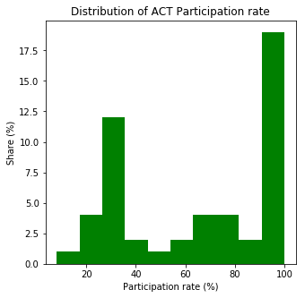


SAT Average Participation Rate (red)


```python
test_data.sat_part.plot(kind='hist', figsize=(5,5), color='red'); 
plt.xlabel('Participation rate (%)');
plt.ylabel('Share (%)');
plt.title('Distribution of SAT Participation rate');
```


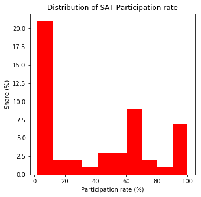


##### Plot the Math(s) distributions from both data sets.


```python
test_data.act_math.plot(kind='hist', figsize=(5,5), color='green'); 
plt.xlabel('Average Math score');
plt.ylabel('Share (%)');
plt.title('Distribution of ACT average Math score');
```


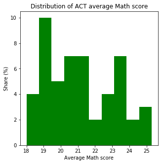


```python
test_data.sat_math.plot(kind='hist', figsize=(5,5), color='red'); 
plt.xlabel('Average Math score');
plt.ylabel('Share (%)');
plt.title('Distribution of SAT average Math score');
```


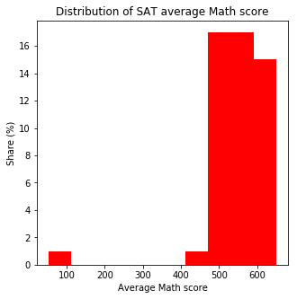


##### Plot the Verbal distributions from both data sets.


```python
# Verbal in ACT = english and reading
avg_verbal = (test_data.act_eng + test_data.act_read)/2
avg_verbal.plot(kind='hist', figsize=(5,5), color='green'); 
plt.xlabel('Average Verbal score');
plt.ylabel('Share (%)');
plt.title('Distribution of ACT average Verbal score');
```


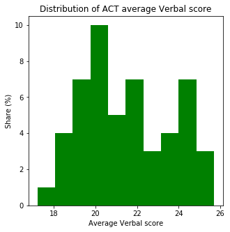


```python
# Verbal in SAT = read and write
test_data.sat_rnw.plot(kind='hist', figsize=(5,5), color='red'); 
plt.xlabel('Average Verbal score');
plt.ylabel('Share (%)');
plt.title('Distribution of SAT average Verbal score');
```


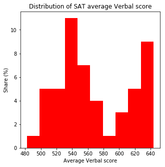


##### When we make assumptions about how data are distributed, what is the most common assumption?

That it's a normal distribution aka a symetric distribution

##### Does the assumption hold true for any of our columns?


```python
def skewness(x):
    if np.mean(x) > np.median(x):
        print(x.name, 'is skewed right/positive')
    elif np.mean(x) < np.median(x):
        print(x.name, 'is skewed left/negative')
    else:
        print(x.name, 'is symetrically distributed')
        
test_data.apply(skewness)
```

    act_part is skewed left/negative
    act_eng is skewed right/positive
    act_math is skewed right/positive
    act_read is skewed right/positive
    act_sci is skewed left/negative
    sat_part is skewed right/positive
    sat_rnw is skewed right/positive
    sat_math is skewed left/negative


    act_part    None
    act_eng     None
    act_math    None
    act_read    None
    act_sci     None
    sat_part    None
    sat_rnw     None
    sat_math    None
    dtype: object


No. All the columns seem to creat a distribution that is skewed either to the left or the right.

##### Plot some scatterplots examining relationships between variables.

**Average Participation Rate, Math and the Verbal parts.** 

Scatter plot for Average participation rate


```python
plt.scatter(test_data.act_part,test_data.sat_part)

z = np.polyfit(test_data.act_part.apply(float), test_data.sat_part.apply(float), 1)
p = np.poly1d(z)
plt.plot(test_data.act_part.apply(float),p(test_data.act_part.apply(float)),"r--")

plt.xlabel('ACT avg participation rate');
plt.ylabel('SAT avg participation rate');
plt.title('Relationship between SAT and ACT partisicpation rate');

# I had to turn the participation data into float to get the trendline to work

plt.show()
```


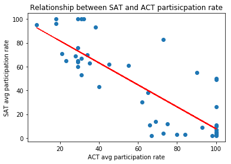


We need to normalize the data for Math befor plotting it.


```python
act_math_larger = []
for s in test_data.act_math:
    s = s * (test_data.sat_math.max()/test_data.act_math.max())
    act_math_larger.append(s)
    
act_math_larger   
```


    [473.45454545454544,
     509.47826086956525,
     509.47826086956525,
     488.89328063241106,
     584.098814229249,
     522.34387351778662,
     632.98814229249012,
     602.11067193675888,
     604.68379446640313,
     499.18577075098813,
     537.78260869565213,
     494.03952569169957,
     560.94071146245062,
     545.501976284585,
     576.37944664031613,
     548.07509881422925,
     548.07509881422925,
     499.18577075098813,
     483.74703557312256,
     617.5494071146245,
     594.39130434782612,
     651.0,
     609.83003952569163,
     553.22134387351775,
     465.73517786561268,
     512.0513833992095,
     519.77075098814225,
     537.78260869565213,
     463.16205533596838,
     645.8537549407115,
     612.403162055336,
     499.18577075098813,
     617.5494071146245,
     496.61264822134387,
     524.91699604743076,
     555.79446640316212,
     483.74703557312256,
     553.22134387351775,
     602.11067193675888,
     599.53754940711462,
     478.600790513834,
     553.22134387351775,
     494.03952569169957,
     532.63636363636363,
     512.0513833992095,
     594.39130434782612,
     599.53754940711462,
     563.51383399209487,
     499.18577075098813,
     524.91699604743076,
     509.47826086956525]


Scatterplot Math with normalized data


```python
plt.ylim(450, 675) # change the interval of the y-axis
plt.xlim(450, 675) # change the interval of the x-axis
         
plt.scatter(act_math_larger,test_data.sat_math)

# apply a trend line
z = np.polyfit(act_math_larger, test_data.sat_math.apply(float), 1)
p = np.poly1d(z)
plt.plot(act_math_larger,p(act_math_larger),"r--")

plt.xlabel('ACT Math');
plt.ylabel('SAT Math');
plt.title('Relationship between SAT and ACT Math scores');

plt.show()
```


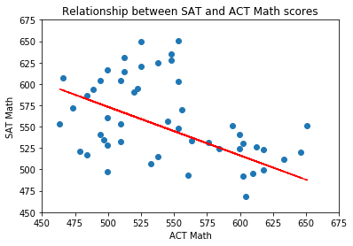


We need to normalize the data for the verbal parts befor plotting it.


```python
avg_verbal_larger = []
for s in avg_verbal:
    s = s * (test_data.sat_rnw.max()/avg_verbal.max())
    avg_verbal_larger.append(s)
    
avg_verbal_larger
```


    [483.62645914396882,
     489.89105058365749,
     484.87937743190662,
     483.62645914396882,
     571.33073929961085,
     517.4552529182879,
     640.24124513618676,
     612.67704280155647,
     617.68871595330734,
     501.16731517509726,
     538.75486381322958,
     463.579766536965,
     562.56031128404663,
     533.74319066147859,
     566.31906614785998,
     548.77821011673143,
     543.76653696498056,
     502.42023346303506,
     491.14396887159535,
     613.92996108949421,
     595.13618677042803,
     642.74708171206225,
     608.91828793774323,
     528.73151750972761,
     463.579766536965,
     508.68482490272373,
     501.16731517509726,
     536.24902723735408,
     431.00389105058372,
     644.0,
     600.14785992217901,
     488.63813229571986,
     606.41245136186774,
     468.59143968871604,
     494.90272373540853,
     547.5252918287938,
     483.62645914396887,
     546.27237354085594,
     596.38910505836566,
     610.17120622568098,
     458.56809338521401,
     538.75486381322958,
     496.15564202334633,
     508.68482490272373,
     504.92607003891044,
     597.64202334630352,
     602.6536964980545,
     538.75486381322958,
     516.20233463035026,
     504.92607003891044,
     503.67315175097281]


Scatterplot for the verbal parts with normalized data


```python
plt.ylim(420, 675) # change the interval of the y-axis
plt.xlim(420, 675) # change the interval of the x-axis
         
plt.scatter(avg_verbal_larger,test_data.sat_rnw)

# apply a trend line
z = np.polyfit(avg_verbal_larger, test_data.sat_rnw.apply(float), 1)
p = np.poly1d(z)
plt.plot(avg_verbal_larger,p(avg_verbal_larger),"r--")

plt.xlabel('ACT Verbal');
plt.ylabel('SAT Verbal');
plt.title('Relationship between SAT and ACT Verbal scores');

plt.show()
```


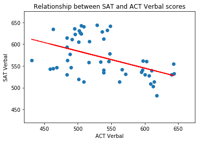


*For the columns that kind of exsists in both test you can clearly see a relationship in all of them.*

**Relations between all the columns**

Make a scatterplot matrix 


```python
fig, ax = plt.subplots(figsize=(20,20))
pd.plotting.scatter_matrix(test_data.iloc[:,:8].astype(float), ax=ax);
```

    /anaconda3/lib/python3.6/site-packages/IPython/core/interactiveshell.py:2862: UserWarning: To output multiple subplots, the figure containing the passed axes is being cleared
      exec(code_obj, self.user_global_ns, self.user_ns)


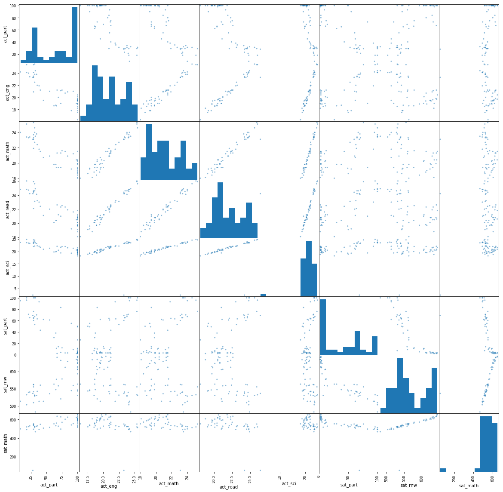


*You can clearly see in the scatterplots above that its visually seems to be a relation between some variables.*
- *All the column that are parts of the ACT* 
- *All the column that are parts of the SAT* 
<BR />
<BR />
*However they are part of the same test and it can be other factors influencing them to move in the same direction.*

##### More about the relationships.

Correlation ACT Participation and ACT English


```python
np.corrcoef(pd.to_numeric(test_data.act_part, downcast='signed'), pd.to_numeric(test_data.act_eng, downcast='signed'))
```


    array([[ 1.        , -0.84350114],
           [-0.84350114,  1.        ]])


Correlation ACT Participation and ACT Math


```python
np.corrcoef(pd.to_numeric(test_data.act_part, downcast='signed'), pd.to_numeric(test_data.act_math, downcast='signed'))
```


    array([[ 1.        , -0.86111446],
           [-0.86111446,  1.        ]])


Correlation ACT Participation and ACT Reading


```python
np.corrcoef(pd.to_numeric(test_data.act_part, downcast='signed'), pd.to_numeric(test_data.act_read, downcast='signed'))
```


    array([[ 1.       , -0.8666204],
           [-0.8666204,  1.       ]])


Correlation ACT Participation and ACT Science


```python
np.corrcoef(pd.to_numeric(test_data.act_part, downcast='signed'), pd.to_numeric(test_data.act_sci, downcast='signed'))
```


    array([[ 1.        , -0.30499178],
           [-0.30499178,  1.        ]])


*There is a strong negativ correlation within ACT.
High participation -> low result on english, math and reading.
But the relationship is not as clear for sciens.*

*More participants - lower score
If you have low grades you do the test and hope for a good result. So you can try to apply to a school on your test score instead of your grades.*

*Fewer participants - higher scores
You are really good in a subject and have good grades, but want to get in to a specific school. Therefor you take the test.*
 
*The 2 things may differ from state to state and that's why we get this effect.* 

Correlation SAT Participation and SAT Reading and Writing


```python
np.corrcoef(pd.to_numeric(test_data.sat_part, downcast='signed'), pd.to_numeric(test_data.sat_rnw, downcast='signed'))
```


    array([[ 1.        , -0.87432575],
           [-0.87432575,  1.        ]])


Correlation SAT Participation and SAT Math


```python
np.corrcoef(pd.to_numeric(test_data.sat_part, downcast='signed'), pd.to_numeric(test_data.sat_math, downcast='signed'))
```


    array([[ 1.        , -0.56655765],
           [-0.56655765,  1.        ]])


*There is strong negativ correlation within SAT.
High participation -> low result on reading and writing.
But not as clear for math.
Same theory as above to why.*

Correlation SAT reading and writing and ACT verbal parts


```python
np.corrcoef(pd.to_numeric(test_data.sat_rnw, downcast='signed'), pd.to_numeric(avg_verbal, downcast='signed'))
```


    array([[ 1.        , -0.47567623],
           [-0.47567623,  1.        ]])


*For the participation rate in the 2 tests it seems like if the participation rate is high in one test, it's low in the other. In other words it's a negativ correlation. 
Here you can explore more if you want to look more into the correlation.*

Correlation avg Participation


```python
np.corrcoef(pd.to_numeric(test_data.act_part, downcast='signed'), pd.to_numeric(test_data.sat_part, downcast='signed'))
```


    array([[ 1.        , -0.84123446],
           [-0.84123446,  1.        ]])


corr(x,y) = corr(y,x) = -0.84123446 (heavily negativ correlation) 

*We have a very strong negativ correlation between participation in the different test. 
Some schools prefer one test over the other but many also accept both. 
Eventhough you can apply with both of them, it is most common that you chose one over the other.*

Correlation avg math


```python
np.corrcoef(pd.to_numeric(test_data.act_math, downcast='signed'), pd.to_numeric(test_data.sat_math, downcast='signed'))
```


    array([[ 1.       , -0.3409059],
           [-0.3409059,  1.       ]])


Correlation avg verbal and read/write


```python
np.corrcoef(pd.to_numeric(avg_verbal, downcast='signed'), pd.to_numeric(test_data.sat_rnw, downcast='signed'))
```


    array([[ 1.        , -0.47567623],
           [-0.47567623,  1.        ]])


*The correlation is not as stong for math and verbal, as for other variables.*

##### Create box plots for each variable. 

ACT average participation rate


```python
test_data.act_part.plot(kind='bar', figsize=(12,5), color='green'); 
plt.xlabel('Average participation rate per state');
plt.ylabel('Share (%)');
plt.title('Distribution of ACT average participation rate per state');
```


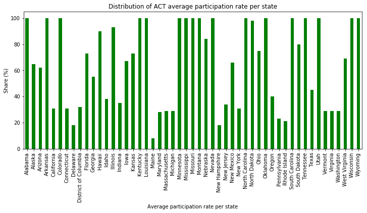


```python
sorted_bar = test_data.sort_values(by=['act_part'], ascending = False).act_part
```


```python
sorted_bar.plot(kind='bar', figsize=(12,5), color='green'); 
plt.xlabel('State', fontsize=14);
plt.ylabel('Average Participation rate (%)', fontsize=14);
plt.title('Distribution of ACT average participation rate per state', fontsize=18);
```


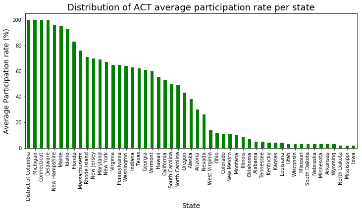


SAT average participation rate


```python
test_data.sat_part.plot(kind='bar', figsize=(12,5), color='red'); 
plt.xlabel('Average participation rate per state');
plt.ylabel('Share (%)');
plt.title('Distribution of SAT average participation rate per state');
```


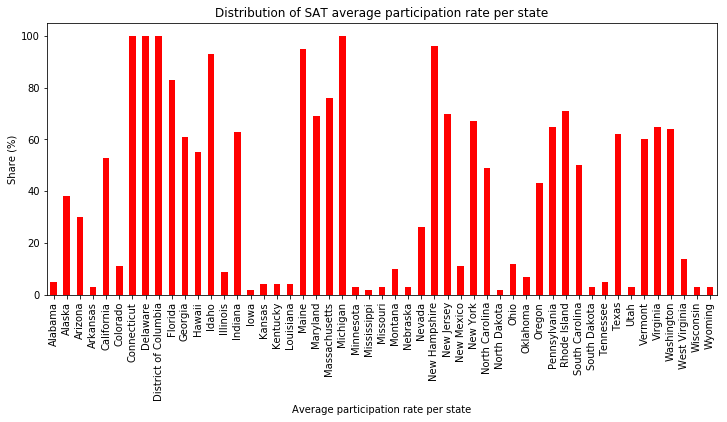


```python
sorted_bar = test_data.sort_values(by=['sat_part'], ascending = False).sat_part
```


```python
sorted_bar.plot(kind='bar', figsize=(12,5), color='r'); 
plt.xlabel('State', fontsize=14);
plt.ylabel('Average Participation rate (%)', fontsize=14);
plt.title('Distribution of SAT average participation rate per state', fontsize=18);
```


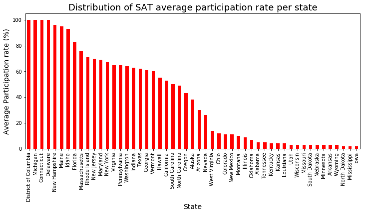


ACT English


```python
test_data.act_eng.plot(kind='bar', figsize=(12,5), color='green'); 
plt.xlabel('Average english score per state');
plt.ylabel('Score');
plt.title('Distribution of ACT average english score per state');
```


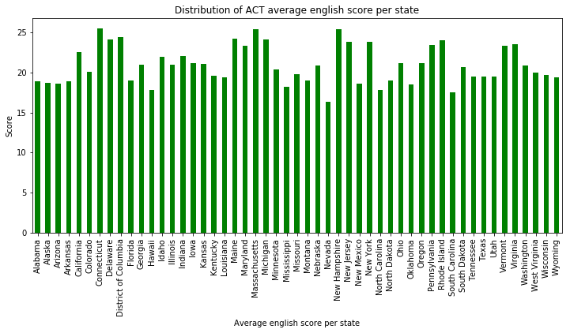


ACT Math


```python
test_data.act_math.plot(kind='bar', figsize=(12,5), color='green'); 
plt.xlabel('Average math score per state');
plt.ylabel('Score');
plt.title('Distribution of ACT average math score per state');
```


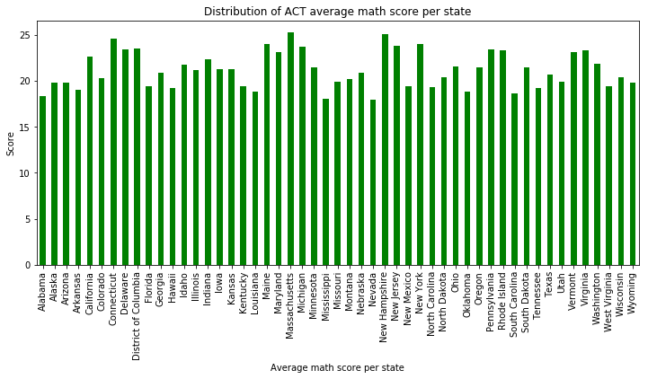


ACT Reading


```python
test_data.act_read.plot(kind='bar', figsize=(12,5), color='green'); 
plt.xlabel('Average reading score per state');
plt.ylabel('Score');
plt.title('Distribution of ACT reading score per state');
```


ACT Science


```python
test_data.act_sci.plot(kind='bar', figsize=(12,5), color='green'); 
plt.xlabel('Average scienc score per state');
plt.ylabel('Score');
plt.title('Distribution of ACT scienc score per state');
```


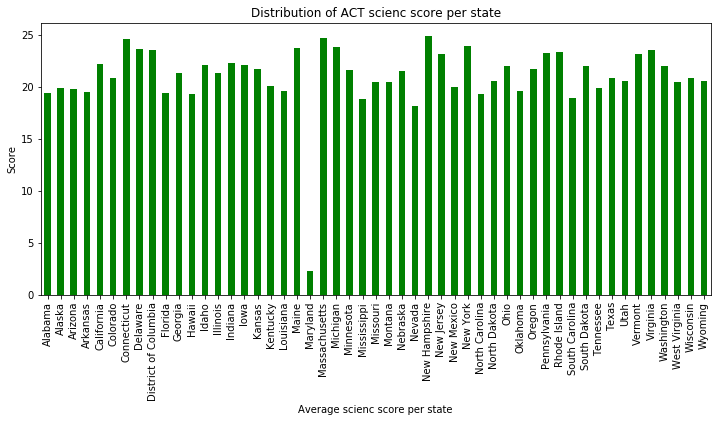


*It is worth to mention that either students in Maryland are really bad at scienc or their data is corrupt in some way regarding the science score. If the ACT science data should be used for further analysis I would suggest looking into this problem and clean the data by calculating the right value and change the data.*

SAT Reading and Writing


```python
test_data.sat_rnw.plot(kind='bar', figsize=(12,5), color='red'); 
plt.xlabel('Average read and write score per state');
plt.ylabel('Score');
plt.title('Distribution of SAT average read and write score per state');
```


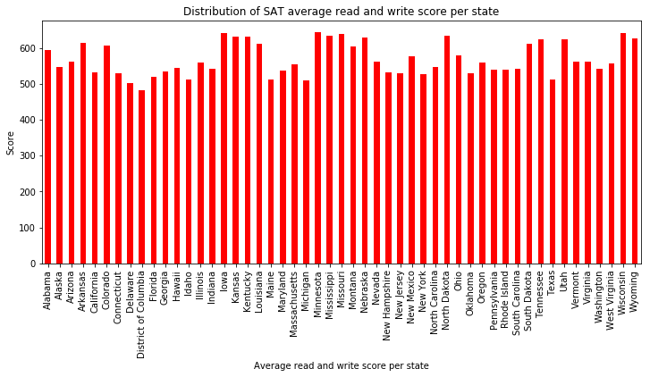


SAT Math


```python
test_data.sat_math.plot(kind='bar', figsize=(12,5), color='red'); 
plt.xlabel('Average math score per state');
plt.ylabel('Score');
plt.title('Distribution of SAT average math score per state');
```


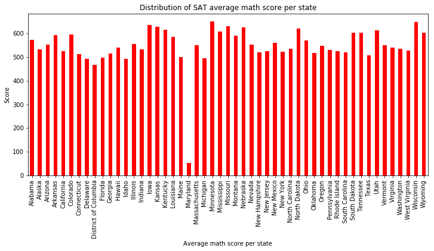


*It is worth to mention that either students in Maryland are really bad at math or their data is corrupt in some way regarding the math score. If you look at the math score from the ACT Maryland do not seem to deviate as much from the other state. Which indicates that something is wrong with the data. If you are going to use this data further, fix the problem.*

Special barplot for Average participationrate for both tests based on state in the same plot.


```python
plt.subplots(figsize=(12,12))   # set a large canvas for plotting
plt.barh(test_data.index, test_data.act_part, label='ACT part', alpha=0.5)   #  make a bar graph
plt.barh(test_data.index, test_data.sat_part, label='SAT part.', alpha=0.5)
plt.axvline(65, label="ACT mean", color='k')  # make a vertical line
plt.axvline(40, label="SAT mean", color='red')  # make a vertical line
plt.legend(loc='lower center')
plt.title("Average Participation Rate for ACT and SAT per State", fontsize=16)
plt.xlabel("Average Participation Rate", fontsize=14)
plt.ylabel("State",fontsize=14)
plt.show()
```


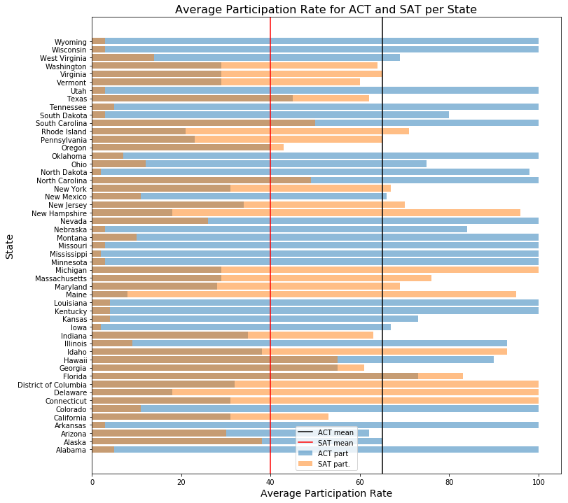


## Descriptive and Inferential Statistics

##### Summarize each distribution.

What is the center? mean (median, and mode)<BR />
What is the spread? standard deviation (range and variance)<BR />
What is the shape? skewness (shape of the curve)

**ACT Average Participation Rate**

Histogram


```python
test_data.act_part.plot(kind='hist', figsize=(5,5), color='green'); 
```


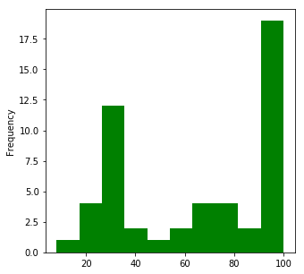


Mean


```python
test_data.act_part.mean()
```


    65.254901960784309


Median


```python
test_data.act_part.median()
```


    69.0


Standard Deviation


```python
test_data.act_part.std()
```


    32.140842015886832


Skewness


```python
# I will call my function def skewness(x) from above 
skewness(test_data.act_part)
```

    act_part is skewed left/negative


*The distribution is negatively skewed, also seen as the mean < median
The standard deviation is somewhat big, which indicates that there is a big spread from the mean value.*

**ACT English**

Histogram


```python
test_data.act_eng.plot(kind='hist', figsize=(5,5), color='green'); 
```


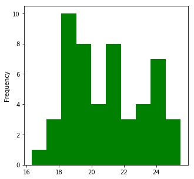


Mean


```python
test_data.act_eng.mean()
```


    20.931372549019606


Median


```python
test_data.act_eng.median()
```


    20.7


Standard Deviation


```python
test_data.act_eng.std()
```


    2.3536771398030303


Skewness


```python
# will call my function def skewness(x): from above
skewness(test_data.act_eng)
```

    act_eng is skewed right/positive


*The distribution is positivly skewed, also seen as the mean > median. The standard deviation is quite big, which indicates that there is a quite big spread from the mean value.*

**ACT Math**

Histogram


```python
test_data.act_math.plot(kind='hist', figsize=(5,5), color='green'); 
```


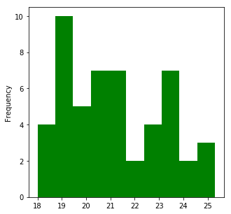


Mean


```python
test_data.act_math.mean()
```


    21.182352941176468


Median


```python
test_data.act_math.median()
```


    20.9


Standard Deviation


```python
test_data.act_math.std()
```


    1.9819894936505533


Skewness


```python
# will call my function def skewness(x): from above
skewness(test_data.act_math)
```

    act_math is skewed right/positive


*The distribution is positivly skewed, also seen as the mean > median. The standard deviation is quite big, which indicates that there is a quite big spread from the mean value.*

**ACT Reading**

Histogram


```python
test_data.act_read.plot(kind='hist', figsize=(5,5), color='green'); 
```


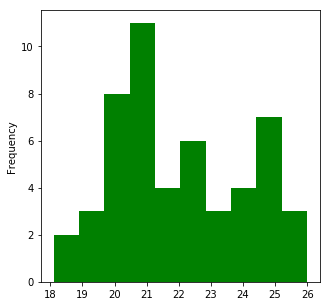


Mean


```python
test_data.act_read.mean()
```


    22.013725490196077


Median


```python
test_data.act_read.median()
```


    21.8


Standard Deviation


```python
test_data.act_read.std()
```


    2.0672706264873146


Skewness


```python
# will call my function def skewness(x): from above
skewness(test_data.act_read)
```

    act_read is skewed right/positive


*The distribution is positivly skewed, also seen as the mean > median. The standard deviation is quite big, which indicates that there is a quite big spread from the mean value.*

**ACT Science**

Histogram


```python
test_data.act_sci.plot(kind='hist', figsize=(5,5), color='green'); 
```


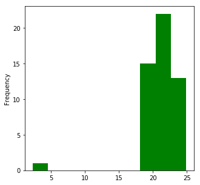


Mean


```python
test_data.act_sci.mean()
```


    21.041176470588237


Median


```python
test_data.act_sci.median()
```


    21.3


Standard Deviation


```python
test_data.act_sci.std()
```


    3.182462975155453


Skewness


```python
# will call my function def skewness(x): from above  
skewness(test_data.act_sci)
```

    act_sci is skewed left/negative


*The distribution is negativly skewed, also seen as the mean < median. The standard deviation is somewhat big, which indicates that there is a big spread from the mean value.*

**SAT Average Participation Rate**

Histogram


```python
test_data.sat_part.plot(kind='hist', figsize=(5,5), color='red'); 
```


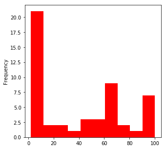


Mean


```python
test_data.sat_part.mean()
```


    39.803921568627452


Median


```python
test_data.sat_part.median()
```


    38.0


Standard Deviation


```python
test_data.sat_part.std()
```


    35.276632270013046


Skewness


```python
# will call my function def skewness(x): from above 
skewness(test_data.sat_part)
```

    sat_part is skewed right/positive


*The distribution is positivly skewed, also seen as the mean > median. The standard deviation is very big, which indicates that there is a very big spread from the mean value.*

**SAT Reading and Writing**

Histogram


```python
test_data.sat_rnw.plot(kind='hist', figsize=(5,5), color='red'); 
```


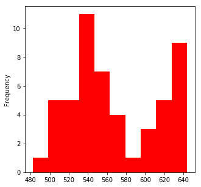


Mean


```python
test_data.sat_rnw.mean()
```


    569.11764705882354


Median


```python
test_data.sat_rnw.median()
```


    559.0


Standard Deviation


```python
test_data.sat_rnw.std()
```


    45.666901387689322


Skewness


```python
# will call my function def skewness(x): from above  
skewness(test_data.sat_rnw)
```

    sat_rnw is skewed right/positive


*The distribution is positivly skewed, also seen as the mean > median. The standard deviation is somewhat big, which indicates that there is a big spread from the mean value.*

**SAT Math**

Histogram


```python
test_data.sat_math.plot(kind='hist', figsize=(5,5), color='red'); 
```


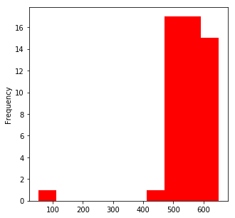


Mean


```python
test_data.sat_math.mean()
```


    547.62745098039215


Median


```python
test_data.sat_math.median()
```


    548.0


Standard Deviation


```python
test_data.sat_math.std()
```


    84.90911865855486


Skewness


```python
# will call my function def skewness(x): from above  
skewness(test_data.sat_math)
```

    sat_math is skewed left/negative


*The distribution is negativly skewed, also seen as the mean < median. The standard deviation is a little bit big, which indicates that there is kind of a big spread from the mean value.*

##### Summarize each relationship.

*You can clearly see that there visualy seems to be a relation between some variables. All the column that are parts of the ACT. All the column that are parts of the SAT. However they are part of the same test and it can be other factors influencing them to move in the same direction.*

*I have instead chosen to study columns that kind of exsists in both test. Average participation rate, math and verbal(eng and read)/readandwrite. You can see a trend in all of them.*

*Above look at the 3 graphs that I choose to do. I did not think it was any point in looking at test part in one test that had no corresponding part n the other test.*

*Correlation participation rate and columns from same test are interesting.*

*Please look at the comments by the plots and the calculated correlation.* 

##### Hypothesis test comparing the SAT and ACT participation rates.

Two-Sample $t$-test

$H_0:$ ```mean test_data.act_part```  =  ```mean test_data.sat_part```<BR />
$H_A:$ ```mean test_data.act_part```  !=  ```mean test_data.sat_part```

We established our significance level to be  $\alpha = 0.05$.
And we are assuming that the variables are independent 


```python
stats.ttest_ind(test_data.act_part, test_data.sat_part)
```


    Ttest_indResult(statistic=3.8085785735927646, pvalue=0.00024134145562512704)


*p-value: 0.00024134145562512704<br />
p < $\alpha$ -> we can reject $H_0$ (we can conclude that there are a different between act_part and sat_part)*

##### 95% confidence intervals for SAT and ACT participation rates.

Confidence interval SAT


```python
# (point estimate +/- multiplier * standard error aka std of a statistic)/ n**0.5
(test_data.sat_part.mean() + 1.96 * test_data.sat_part.std())/(np.sqrt(len(test_data.sat_part)))
```


    15.255508321334894


```python
(test_data.sat_part.mean() - 1.96 * test_data.sat_part.std())/(np.sqrt(len(test_data.act_part)))
```


    -4.1081805935825013


Confidence interval ACT


```python
# (point estimate +/- multiplier * standard error aka std of a statistic)/ n**0.5
(test_data.act_part.mean() + 1.96 * test_data.act_part.std())/(np.sqrt(len(test_data.act_part)))
```


    17.958725428001109


```python
(test_data.act_part.mean() - 1.96 * test_data.act_part.std())/(np.sqrt(len(test_data.act_part)))
```


    0.31630249217620765


##### Comment

*We rejected $H_0$ and the confidence inteval is quite big. The correlation in there, but the hypothesis does not hold because the mean are not the same.* 

##### Correlation between SAT and ACT math scores.


```python
np.corrcoef(pd.to_numeric(test_data.act_math, downcast='signed'), pd.to_numeric(test_data.sat_math, downcast='signed'))
```


    array([[ 1.       , -0.3409059],
           [-0.3409059,  1.       ]])


*Quite weak negative correlation. The reason to why you wanted to check is that if there would have been a strong correlation you could have done something general in the society to affect the participationrate i both tests. Now it seems that one fix might not be beneficial for both test.*

##### Comments to the SAT board

*The advice for the SAT board is to start to look at the SAT reading and writing part since that part in strongly negativly correlted with the SAT Average participation rate. <BR />
More participants -> lower scores in the reading and writing part<BR />
Less participants -> higher scores in the reading and writing part<BR />
The verbal parts between the two tests are not that strongly correlated. Therefor a directed effort might be need and not a broader approach.*   

*Further they need to start on focusing on states with low participation rate. For example Iowa, Mississippi, North Dakota and other states shown in the bar chart above sorted after SAT participation rate. 
The participation rate for the two tests are high/low in different states. With that said it might be a attitude question among the schools or the students.*

*With more time you can dive deeper into this data, focusing more on specific correlation or what it looks like in specific states.*

*Further areas of interest:
-Survey (attitude students + do the schools ask for different things)
-Higher participation to any cost (lower scores?)
-Other countries (best practice studie)*
